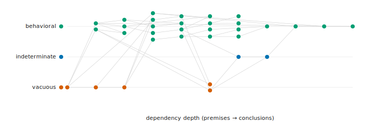

# Paperkit — Verification Report

*Generated by running the pipeline on this repository — every figure below is live tool output, gated fresh-by-construction.*

## Gate status

Both the paper and the README pass the gate with zero postulates [@rpt-status] — the verdict per document [@rpt-status-out].

| document | gate (--safe) | prose ≡ projection | checks verified | sections |
| --- | --- | --- | --- | --- |
| paper | PASS | yes | 33 | 7 |
| README | PASS | yes | 22 | 8 |

## Check adequacy (Δ)

Δ grades each cited claim's check by whether it can actually fail [@rpt-delta] — the grade of every cited claim, with why this grade and why not a higher or lower one [@rpt-delta-out].

_33 cited claims — self-grade: 26 behavioral, 2 indeterminate, 5 vacuous; effective (clamped by entailment): 18 behavioral, 15 vacuous; 10 clamped below self._

| claim | self → effective | witness | why this grade | why not higher | why not lower |
| --- | --- | --- | --- | --- | --- |
| `paper-is-projection` | vacuous | `file:../paperkit/project.py` | existence of a required project/engine source — presupposed by the build | to rise: give it a check that can FAIL — a file: of a presupposed input is removed by no real change | vacuous is the floor |
| `node-is-claim` | vacuous | `file:warrants.bib` | existence of a required project/engine source — presupposed by the build | to rise: give it a check that can FAIL — a file: of a presupposed input is removed by no real change | vacuous is the floor |
| `claim-bears-check` | vacuous | `file:warrants.bib` | existence of a required project/engine source — presupposed by the build | to rise: give it a check that can FAIL — a file: of a presupposed input is removed by no real change | vacuous is the floor |
| `fail-omits` | behavioral → **vacuous** | `cmd:sh checks/projection-stable.sh` | falsifiable — corrupting 5 input(s) flips it red | behavioral is the top tier; a proof-grade (total, postulate-free witness) tier is not yet defined | not indeterminate/vacuous: a mutation DOES flip it (sensitive to 5 input(s)) |
| `claim-is-record` | behavioral → **vacuous** | `claim:claim-is-record` | falsifiable — corrupting 1 input(s) flips it red | behavioral is the top tier; a proof-grade (total, postulate-free witness) tier is not yet defined | not indeterminate/vacuous: a mutation DOES flip it (sensitive to 1 input(s)) |
| `record-is-bibentry` | behavioral → **vacuous** | `claim:record-is-bibentry` | falsifiable — corrupting 1 input(s) flips it red | behavioral is the top tier; a proof-grade (total, postulate-free witness) tier is not yet defined | not indeterminate/vacuous: a mutation DOES flip it (sensitive to 1 input(s)) |
| `prose-projected` | behavioral | `claim:prose-projected` | falsifiable — corrupting 1 input(s) flips it red | behavioral is the top tier; a proof-grade (total, postulate-free witness) tier is not yet defined | not indeterminate/vacuous: a mutation DOES flip it (sensitive to 1 input(s)) |
| `ordered-by-deps` | behavioral | `claim:ordered-by-deps` | falsifiable — corrupting 1 input(s) flips it red | behavioral is the top tier; a proof-grade (total, postulate-free witness) tier is not yet defined | not indeterminate/vacuous: a mutation DOES flip it (sensitive to 1 input(s)) |
| `joined-by-glue` | behavioral | `claim:joined-by-glue` | falsifiable — corrupting 1 input(s) flips it red | behavioral is the top tier; a proof-grade (total, postulate-free witness) tier is not yet defined | not indeterminate/vacuous: a mutation DOES flip it (sensitive to 1 input(s)) |
| `deterministic` | behavioral | `claim:deterministic` | falsifiable — corrupting 1 input(s) flips it red | behavioral is the top tier; a proof-grade (total, postulate-free witness) tier is not yet defined | not indeterminate/vacuous: a mutation DOES flip it (sensitive to 1 input(s)) |
| `projector-emits` | behavioral | `claim:projector-emits` | falsifiable — corrupting 1 input(s) flips it red | behavioral is the top tier; a proof-grade (total, postulate-free witness) tier is not yet defined | not indeterminate/vacuous: a mutation DOES flip it (sensitive to 1 input(s)) |
| `prose-is-artifact` | behavioral | `claim:prose-is-artifact` | falsifiable — corrupting 1 input(s) flips it red | behavioral is the top tier; a proof-grade (total, postulate-free witness) tier is not yet defined | not indeterminate/vacuous: a mutation DOES flip it (sensitive to 1 input(s)) |
| `gate-rejects-drift` | behavioral | `claim:gate-rejects-drift` | falsifiable — corrupting 1 input(s) flips it red | behavioral is the top tier; a proof-grade (total, postulate-free witness) tier is not yet defined | not indeterminate/vacuous: a mutation DOES flip it (sensitive to 1 input(s)) |
| `edit-cant-survive` | behavioral | `claim:edit-cant-survive` | falsifiable — corrupting 1 input(s) flips it red | behavioral is the top tier; a proof-grade (total, postulate-free witness) tier is not yet defined | not indeterminate/vacuous: a mutation DOES flip it (sensitive to 1 input(s)) |
| `coverage-both-sides` | behavioral | `claim:coverage-both-sides` | falsifiable — corrupting 1 input(s) flips it red | behavioral is the top tier; a proof-grade (total, postulate-free witness) tier is not yet defined | not indeterminate/vacuous: a mutation DOES flip it (sensitive to 1 input(s)) |
| `every-section-appears` | behavioral | `claim:every-section-appears` | falsifiable — corrupting 1 input(s) flips it red | behavioral is the top tier; a proof-grade (total, postulate-free witness) tier is not yet defined | not indeterminate/vacuous: a mutation DOES flip it (sensitive to 1 input(s)) |
| `every-claim-cited` | behavioral | `claim:every-claim-cited` | falsifiable — corrupting 1 input(s) flips it red | behavioral is the top tier; a proof-grade (total, postulate-free witness) tier is not yet defined | not indeterminate/vacuous: a mutation DOES flip it (sensitive to 1 input(s)) |
| `verifier-named` | behavioral | `claim:verifier-named` | falsifiable — corrupting 1 input(s) flips it red | behavioral is the top tier; a proof-grade (total, postulate-free witness) tier is not yet defined | not indeterminate/vacuous: a mutation DOES flip it (sensitive to 1 input(s)) |
| `gate-dispatches` | behavioral | `claim:gate-dispatches` | falsifiable — corrupting 1 input(s) flips it red | behavioral is the top tier; a proof-grade (total, postulate-free witness) tier is not yet defined | not indeterminate/vacuous: a mutation DOES flip it (sensitive to 1 input(s)) |
| `new-domain-adds` | behavioral | `claim:new-domain-adds` | falsifiable — corrupting 1 input(s) flips it red | behavioral is the top tier; a proof-grade (total, postulate-free witness) tier is not yet defined | not indeterminate/vacuous: a mutation DOES flip it (sensitive to 1 input(s)) |
| `two-builtins` | behavioral | `claim:two-builtins` | falsifiable — corrupting 1 input(s) flips it red | behavioral is the top tier; a proof-grade (total, postulate-free witness) tier is not yet defined | not indeterminate/vacuous: a mutation DOES flip it (sensitive to 1 input(s)) |
| `file-builtin` | behavioral | `claim:file-builtin` | falsifiable — corrupting 1 input(s) flips it red | behavioral is the top tier; a proof-grade (total, postulate-free witness) tier is not yet defined | not indeterminate/vacuous: a mutation DOES flip it (sensitive to 1 input(s)) |
| `cmd-builtin` | behavioral | `claim:cmd-builtin` | falsifiable — corrupting 1 input(s) flips it red | behavioral is the top tier; a proof-grade (total, postulate-free witness) tier is not yet defined | not indeterminate/vacuous: a mutation DOES flip it (sensitive to 1 input(s)) |
| `cmd-escape` | behavioral | `claim:cmd-escape` | falsifiable — corrupting 1 input(s) flips it red | behavioral is the top tier; a proof-grade (total, postulate-free witness) tier is not yet defined | not indeterminate/vacuous: a mutation DOES flip it (sensitive to 1 input(s)) |
| `paper-is-paperkit` | behavioral → **vacuous** | `cmd:sh checks/projection-stable.sh` | falsifiable — corrupting 5 input(s) flips it red | behavioral is the top tier; a proof-grade (total, postulate-free witness) tier is not yet defined | not indeterminate/vacuous: a mutation DOES flip it (sensitive to 5 input(s)) |
| `claims-are-warrants` | vacuous | `file:warrants.bib` | existence of a required project/engine source — presupposed by the build | to rise: give it a check that can FAIL — a file: of a presupposed input is removed by no real change | vacuous is the floor |
| `prose-is-projection` | behavioral → **vacuous** | `cmd:sh checks/projection-stable.sh` | falsifiable — corrupting 5 input(s) flips it red | behavioral is the top tier; a proof-grade (total, postulate-free witness) tier is not yet defined | not indeterminate/vacuous: a mutation DOES flip it (sensitive to 5 input(s)) |
| `gate-is-subject` | vacuous | `file:../paperkit/gate.py` | existence of a required project/engine source — presupposed by the build | to rise: give it a check that can FAIL — a file: of a presupposed input is removed by no real change | vacuous is the floor |
| `paperkit-on-paperkit` | indeterminate → **vacuous** | `cmd:sh checks/drift-caught.sh` | no generic mutation flips it — vacuous OR a negative-assertion check; needs a targeted counter-fixture (Π) | to rise: a targeted counter-fixture (a positive mutation) would prove it behavioral | not provably vacuous: it runs a cmd:, not a presupposed file: |
| `one-green-check` | indeterminate → **vacuous** | `cmd:sh checks/drift-caught.sh` | no generic mutation flips it — vacuous OR a negative-assertion check; needs a targeted counter-fixture (Π) | to rise: a targeted counter-fixture (a positive mutation) would prove it behavioral | not provably vacuous: it runs a cmd:, not a presupposed file: |
| `closes-gap` | behavioral → **vacuous** | `cmd:sh checks/projection-stable.sh` | falsifiable — corrupting 5 input(s) flips it red | behavioral is the top tier; a proof-grade (total, postulate-free witness) tier is not yet defined | not indeterminate/vacuous: a mutation DOES flip it (sensitive to 5 input(s)) |
| `unverified-cant-ship` | behavioral → **vacuous** | `cmd:sh checks/projection-stable.sh` | falsifiable — corrupting 5 input(s) flips it red | behavioral is the top tier; a proof-grade (total, postulate-free witness) tier is not yet defined | not indeterminate/vacuous: a mutation DOES flip it (sensitive to 5 input(s)) |
| `not-project` | behavioral → **vacuous** | `cmd:sh checks/projection-stable.sh` | falsifiable — corrupting 5 input(s) flips it red | behavioral is the top tier; a proof-grade (total, postulate-free witness) tier is not yet defined | not indeterminate/vacuous: a mutation DOES flip it (sensitive to 5 input(s)) |

## Proof-relevance (--without-K)

Some cited claims still share a witness, so --without-K does not yet pass [@rpt-proof] — the shared witnesses [@rpt-proof-out].

| shared witness | claims | collapsed onto it |
| --- | --- | --- |
| `cmd:sh checks/drift-caught.sh` | 2 | one-green-check, paperkit-on-paperkit |
| `cmd:sh checks/projection-stable.sh` | 6 | closes-gap, fail-omits, not-project, paper-is-paperkit, prose-is-projection, unverified-cant-ship |
| `file:warrants.bib` | 3 | claim-bears-check, claims-are-warrants, node-is-claim |

## Adequacy along the entailment DAG

Walking the GROUNDING DAG (rests-on, distinct from prose order) from foundational atoms to the theses they support, each claim's adequacy grade plots against its grounding depth [@rpt-dag] — the foundational atoms on the left, the theses they ground on the right, the effective grade on the vertical axis [@rpt-dag-fig].

A claim is no better grounded than its weakest premise, so each node sits at its effective (clamped) grade, with a ghost rising to its self-check grade wherever premises drag it down [@rpt-clamp]. The figure is rendered from the pipeline data and gated fresh, never placed by hand [@rpt-fig-data], and is mechanically accessible: its colours are the Okabe-Ito colour-blind-safe palette [@rpt-fig-palette], all its text is dark on a light ground [@rpt-fig-contrast], and it is well-formed vector SVG [@rpt-fig-svg].

