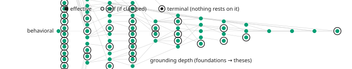

# Paperkit — Verification Report

*Generated by running the pipeline on this repository — every figure below is live tool output, gated fresh-by-construction.*

## Gate status

Every document the local CI gates passes the gate with zero postulates [@rpt-status] — the verdict per document, each project discovered, not hand-listed [@rpt-status-out].

<!-- paperkit:raw -->
| document | gate (--safe) | prose ≡ projection | checks verified | sections | CI tier |
| --- | --- | --- | --- | --- | --- |
| paper | PASS | yes | 111 | 15 | //:hook |
| README | PASS | yes | 24 | 8 | //:hook |
| arch | PASS | yes | 7 | 2 | //:hook |
| boundaries | PASS | yes | 55 | 3 | //:hook |
| config | PASS | yes | 4 | 2 | //:hook |
| demo | PASS | yes | 1 | 1 | //:hook |
| guide | PASS | yes | 9 | 5 | //:hook |
| image | on-demand | — | — | — | wired |
| paperkit/library | PASS | yes | 43 | 7 | //:hook |
| render | PASS | yes | 34 | 12 | //:hook |
| setup | on-demand | — | — | — | wired |
| talk | PASS | yes | 34 | 6 | //:hook |
<!-- /paperkit:raw -->

Gate reproducibility splits the documents, and the report CHARACTERIZES the split rather than merely scoping around it — the sandbox-clean set gates deterministically and is run above, while render, image, and setup gate non-reproducibly because named checks shell named external toolchains: render's shell pandoc and libreoffice, image's shell podman whose build fetches over the network, and setup's shell systemd-run, so each on-demand verdict varies with build-cache and network state — determinism.py names the exact command behind each, so the non-reproducibility is itself reproducible on demand [@rpt-reproducible]. And the variance is bounded and disclosed, three mitigations proven in place — image's img-stable gates that two independent --no-cache builds yield the SAME content digest, so the artifact is reproducible even when building it is not, confining the non-determinism to build cost rather than to what is verified; the report's gate runner labels a document it cannot verify here as on-demand or n/a, never a false verification FAIL; and the cache-warmth variance is itself stabilized by retrying to a warm-cache fixpoint — rerun while the verdict changes, return the converged warm result — while a verdict that never converges is flagged as a non-cache clock or threshold cause for separate characterization, not laundered as reproducible [@rpt-mitigation].

## Check adequacy (Δ)

Δ grades each cited claim's check by whether it can actually fail [@rpt-delta] — the grade of every cited claim in every document, with why this grade and why not a higher or lower one [@rpt-delta-out].

<!-- paperkit:raw -->
### paper

_111 cited claims — self-grade: 111 behavioral; effective (clamped by entailment): 111 behavioral; 0 clamped below self._

| claim | self → effective | witness | why this grade | why not higher | why not lower |
| --- | --- | --- | --- | --- | --- |
| `paper-is-projection` | behavioral | `concept:paper-is-projection` | falsifiable — corrupting 122 input(s) flips it red | behavioral is the top tier; a proof-grade (total, postulate-free witness) tier is not yet defined | not indeterminate/vacuous: a mutation DOES flip it (sensitive to 122 input(s)) |
| `node-is-claim` | behavioral | `claim:node-is-claim` | falsifiable — corrupting 35 input(s) flips it red | behavioral is the top tier; a proof-grade (total, postulate-free witness) tier is not yet defined | not indeterminate/vacuous: a mutation DOES flip it (sensitive to 35 input(s)) |
| `claim-bears-check` | behavioral | `concept:claim-bears-check` | falsifiable — corrupting 56 input(s) flips it red | behavioral is the top tier; a proof-grade (total, postulate-free witness) tier is not yet defined | not indeterminate/vacuous: a mutation DOES flip it (sensitive to 56 input(s)) |
| `fail-omits` | behavioral | `concept:fail-omits` | falsifiable — corrupting 160 input(s) flips it red | behavioral is the top tier; a proof-grade (total, postulate-free witness) tier is not yet defined | not indeterminate/vacuous: a mutation DOES flip it (sensitive to 160 input(s)) |
| `claim-is-record` | behavioral | `concept:claim-is-record` | falsifiable — corrupting 41 input(s) flips it red | behavioral is the top tier; a proof-grade (total, postulate-free witness) tier is not yet defined | not indeterminate/vacuous: a mutation DOES flip it (sensitive to 41 input(s)) |
| `record-is-bibentry` | behavioral | `claim:record-is-bibentry` | falsifiable — corrupting 36 input(s) flips it red | behavioral is the top tier; a proof-grade (total, postulate-free witness) tier is not yet defined | not indeterminate/vacuous: a mutation DOES flip it (sensitive to 36 input(s)) |
| `prose-projected` | behavioral | `claim:prose-projected` | falsifiable — corrupting 112 input(s) flips it red | behavioral is the top tier; a proof-grade (total, postulate-free witness) tier is not yet defined | not indeterminate/vacuous: a mutation DOES flip it (sensitive to 112 input(s)) |
| `ordered-by-deps` | behavioral | `claim:ordered-by-deps` | falsifiable — corrupting 119 input(s) flips it red | behavioral is the top tier; a proof-grade (total, postulate-free witness) tier is not yet defined | not indeterminate/vacuous: a mutation DOES flip it (sensitive to 119 input(s)) |
| `joined-by-glue` | behavioral | `claim:joined-by-glue` | falsifiable — corrupting 121 input(s) flips it red | behavioral is the top tier; a proof-grade (total, postulate-free witness) tier is not yet defined | not indeterminate/vacuous: a mutation DOES flip it (sensitive to 121 input(s)) |
| `deterministic` | behavioral | `claim:deterministic` | falsifiable — corrupting 112 input(s) flips it red | behavioral is the top tier; a proof-grade (total, postulate-free witness) tier is not yet defined | not indeterminate/vacuous: a mutation DOES flip it (sensitive to 112 input(s)) |
| `edge-from-orders` | behavioral | `claim:edge-from-orders` | falsifiable — corrupting 119 input(s) flips it red | behavioral is the top tier; a proof-grade (total, postulate-free witness) tier is not yet defined | not indeterminate/vacuous: a mutation DOES flip it (sensitive to 119 input(s)) |
| `edge-rests-grounds` | behavioral | `concept:edge-rests-grounds` | falsifiable — corrupting 21 input(s) flips it red | behavioral is the top tier; a proof-grade (total, postulate-free witness) tier is not yet defined | not indeterminate/vacuous: a mutation DOES flip it (sensitive to 21 input(s)) |
| `edge-chiral` | behavioral | `claim:edge-chiral` | falsifiable — corrupting 17 input(s) flips it red | behavioral is the top tier; a proof-grade (total, postulate-free witness) tier is not yet defined | not indeterminate/vacuous: a mutation DOES flip it (sensitive to 17 input(s)) |
| `edge-move-types` | behavioral | `claim:edge-move-types` | falsifiable — corrupting 9 input(s) flips it red | behavioral is the top tier; a proof-grade (total, postulate-free witness) tier is not yet defined | not indeterminate/vacuous: a mutation DOES flip it (sensitive to 9 input(s)) |
| `edge-formulas` | behavioral | `claim:edge-formulas` | falsifiable — corrupting 61 input(s) flips it red | behavioral is the top tier; a proof-grade (total, postulate-free witness) tier is not yet defined | not indeterminate/vacuous: a mutation DOES flip it (sensitive to 61 input(s)) |
| `projector-emits` | behavioral | `concept:projector-emits` | falsifiable — corrupting 122 input(s) flips it red | behavioral is the top tier; a proof-grade (total, postulate-free witness) tier is not yet defined | not indeterminate/vacuous: a mutation DOES flip it (sensitive to 122 input(s)) |
| `prose-is-artifact` | behavioral | `claim:prose-is-artifact` | falsifiable — corrupting 2 input(s) flips it red | behavioral is the top tier; a proof-grade (total, postulate-free witness) tier is not yet defined | not indeterminate/vacuous: a mutation DOES flip it (sensitive to 2 input(s)) |
| `gate-rejects-drift` | behavioral | `concept:gate-rejects-drift` | falsifiable — corrupting 145 input(s) flips it red | behavioral is the top tier; a proof-grade (total, postulate-free witness) tier is not yet defined | not indeterminate/vacuous: a mutation DOES flip it (sensitive to 145 input(s)) |
| `edit-cant-survive` | behavioral | `claim:edit-cant-survive` | falsifiable — corrupting 142 input(s) flips it red | behavioral is the top tier; a proof-grade (total, postulate-free witness) tier is not yet defined | not indeterminate/vacuous: a mutation DOES flip it (sensitive to 142 input(s)) |
| `coverage-both-sides` | behavioral | `claim:coverage-both-sides` | falsifiable — corrupting 1 input(s) flips it red | behavioral is the top tier; a proof-grade (total, postulate-free witness) tier is not yet defined | not indeterminate/vacuous: a mutation DOES flip it (sensitive to 1 input(s)) |
| `every-section-appears` | behavioral | `claim:every-section-appears` | falsifiable — corrupting 2 input(s) flips it red | behavioral is the top tier; a proof-grade (total, postulate-free witness) tier is not yet defined | not indeterminate/vacuous: a mutation DOES flip it (sensitive to 2 input(s)) |
| `every-claim-cited` | behavioral | `claim:every-claim-cited` | falsifiable — corrupting 1 input(s) flips it red | behavioral is the top tier; a proof-grade (total, postulate-free witness) tier is not yet defined | not indeterminate/vacuous: a mutation DOES flip it (sensitive to 1 input(s)) |
| `module-split` | behavioral | `claim:module-split` | falsifiable — corrupting 8 input(s) flips it red | behavioral is the top tier; a proof-grade (total, postulate-free witness) tier is not yet defined | not indeterminate/vacuous: a mutation DOES flip it (sensitive to 8 input(s)) |
| `verifier-named` | behavioral | `concept:verifier-named` | falsifiable — corrupting 47 input(s) flips it red | behavioral is the top tier; a proof-grade (total, postulate-free witness) tier is not yet defined | not indeterminate/vacuous: a mutation DOES flip it (sensitive to 47 input(s)) |
| `gate-dispatches` | behavioral | `concept:gate-dispatches` | falsifiable — corrupting 47 input(s) flips it red | behavioral is the top tier; a proof-grade (total, postulate-free witness) tier is not yet defined | not indeterminate/vacuous: a mutation DOES flip it (sensitive to 47 input(s)) |
| `new-domain-adds` | behavioral | `concept:new-domain-adds` | falsifiable — corrupting 21 input(s) flips it red | behavioral is the top tier; a proof-grade (total, postulate-free witness) tier is not yet defined | not indeterminate/vacuous: a mutation DOES flip it (sensitive to 21 input(s)) |
| `two-builtins` | behavioral | `concept:two-builtins` | falsifiable — corrupting 47 input(s) flips it red | behavioral is the top tier; a proof-grade (total, postulate-free witness) tier is not yet defined | not indeterminate/vacuous: a mutation DOES flip it (sensitive to 47 input(s)) |
| `file-builtin` | behavioral | `claim:file-builtin` | falsifiable — corrupting 5 input(s) flips it red | behavioral is the top tier; a proof-grade (total, postulate-free witness) tier is not yet defined | not indeterminate/vacuous: a mutation DOES flip it (sensitive to 5 input(s)) |
| `cmd-builtin` | behavioral | `claim:cmd-builtin` | falsifiable — corrupting 19 input(s) flips it red | behavioral is the top tier; a proof-grade (total, postulate-free witness) tier is not yet defined | not indeterminate/vacuous: a mutation DOES flip it (sensitive to 19 input(s)) |
| `result-builtin` | behavioral | `claim:result-builtin` | falsifiable — corrupting 152 input(s) flips it red | behavioral is the top tier; a proof-grade (total, postulate-free witness) tier is not yet defined | not indeterminate/vacuous: a mutation DOES flip it (sensitive to 152 input(s)) |
| `agree-builtin` | behavioral | `claim:agree-builtin` | falsifiable — corrupting 14 input(s) flips it red | behavioral is the top tier; a proof-grade (total, postulate-free witness) tier is not yet defined | not indeterminate/vacuous: a mutation DOES flip it (sensitive to 14 input(s)) |
| `cmd-escape` | behavioral | `concept:cmd-escape` | falsifiable — corrupting 21 input(s) flips it red | behavioral is the top tier; a proof-grade (total, postulate-free witness) tier is not yet defined | not indeterminate/vacuous: a mutation DOES flip it (sensitive to 21 input(s)) |
| `dataset-backed` | behavioral | `claim:dataset-backed` | falsifiable — corrupting 19 input(s) flips it red | behavioral is the top tier; a proof-grade (total, postulate-free witness) tier is not yet defined | not indeterminate/vacuous: a mutation DOES flip it (sensitive to 19 input(s)) |
| `dataset-fresh` | behavioral | `claim:dataset-fresh` | falsifiable — corrupting 19 input(s) flips it red | behavioral is the top tier; a proof-grade (total, postulate-free witness) tier is not yet defined | not indeterminate/vacuous: a mutation DOES flip it (sensitive to 19 input(s)) |
| `concept-builtin` | behavioral | `concept:concept-builtin` | falsifiable — corrupting 8 input(s) flips it red | behavioral is the top tier; a proof-grade (total, postulate-free witness) tier is not yet defined | not indeterminate/vacuous: a mutation DOES flip it (sensitive to 8 input(s)) |
| `concept-interned` | behavioral | `concept:concept-interned` | falsifiable — corrupting 4 input(s) flips it red | behavioral is the top tier; a proof-grade (total, postulate-free witness) tier is not yet defined | not indeterminate/vacuous: a mutation DOES flip it (sensitive to 4 input(s)) |
| `concept-views` | behavioral | `concept:concept-views` | falsifiable — corrupting 280 input(s) flips it red | behavioral is the top tier; a proof-grade (total, postulate-free witness) tier is not yet defined | not indeterminate/vacuous: a mutation DOES flip it (sensitive to 280 input(s)) |
| `concept-shareable` | behavioral | `concept:concept-shareable` | falsifiable — corrupting 39 input(s) flips it red | behavioral is the top tier; a proof-grade (total, postulate-free witness) tier is not yet defined | not indeterminate/vacuous: a mutation DOES flip it (sensitive to 39 input(s)) |
| `key-graded` | behavioral | `concept:graded-key` | falsifiable — corrupting 11 input(s) flips it red | behavioral is the top tier; a proof-grade (total, postulate-free witness) tier is not yet defined | not indeterminate/vacuous: a mutation DOES flip it (sensitive to 11 input(s)) |
| `label-orbit` | behavioral | `concept:label-carrier` | falsifiable — corrupting 19 input(s) flips it red | behavioral is the top tier; a proof-grade (total, postulate-free witness) tier is not yet defined | not indeterminate/vacuous: a mutation DOES flip it (sensitive to 19 input(s)) |
| `cache-slice` | behavioral | `concept:slice-cache` | falsifiable — corrupting 39 input(s) flips it red | behavioral is the top tier; a proof-grade (total, postulate-free witness) tier is not yet defined | not indeterminate/vacuous: a mutation DOES flip it (sensitive to 39 input(s)) |
| `conclusion-gated` | behavioral | `concept:conclusion-backed` | falsifiable — corrupting 17 input(s) flips it red | behavioral is the top tier; a proof-grade (total, postulate-free witness) tier is not yet defined | not indeterminate/vacuous: a mutation DOES flip it (sensitive to 17 input(s)) |
| `conclusion-direction` | behavioral | `concept:conclusion-weak-direction` | falsifiable — corrupting 17 input(s) flips it red | behavioral is the top tier; a proof-grade (total, postulate-free witness) tier is not yet defined | not indeterminate/vacuous: a mutation DOES flip it (sensitive to 17 input(s)) |
| `weave-sentence` | behavioral | `claim:weave-sentence` | falsifiable — corrupting 118 input(s) flips it red | behavioral is the top tier; a proof-grade (total, postulate-free witness) tier is not yet defined | not indeterminate/vacuous: a mutation DOES flip it (sensitive to 118 input(s)) |
| `connector-resolution` | behavioral | `claim:connector-resolution` | falsifiable — corrupting 124 input(s) flips it red | behavioral is the top tier; a proof-grade (total, postulate-free witness) tier is not yet defined | not indeterminate/vacuous: a mutation DOES flip it (sensitive to 124 input(s)) |
| `emit-placement` | behavioral | `claim:emit-placement` | falsifiable — corrupting 129 input(s) flips it red | behavioral is the top tier; a proof-grade (total, postulate-free witness) tier is not yet defined | not indeterminate/vacuous: a mutation DOES flip it (sensitive to 129 input(s)) |
| `config-flags` | behavioral | `claim:config-flags` | falsifiable — corrupting 111 input(s) flips it red | behavioral is the top tier; a proof-grade (total, postulate-free witness) tier is not yet defined | not indeterminate/vacuous: a mutation DOES flip it (sensitive to 111 input(s)) |
| `latex-clean` | behavioral | `claim:latex-clean` | falsifiable — corrupting 115 input(s) flips it red | behavioral is the top tier; a proof-grade (total, postulate-free witness) tier is not yet defined | not indeterminate/vacuous: a mutation DOES flip it (sensitive to 115 input(s)) |
| `resolve-passes` | behavioral | `claim:resolve-passes` | falsifiable — corrupting 157 input(s) flips it red | behavioral is the top tier; a proof-grade (total, postulate-free witness) tier is not yet defined | not indeterminate/vacuous: a mutation DOES flip it (sensitive to 157 input(s)) |
| `safe-rejects-postulates` | behavioral | `claim:safe-rejects-postulates` | falsifiable — corrupting 175 input(s) flips it red | behavioral is the top tier; a proof-grade (total, postulate-free witness) tier is not yet defined | not indeterminate/vacuous: a mutation DOES flip it (sensitive to 175 input(s)) |
| `without-k-distinct` | behavioral | `claim:without-k-distinct` | falsifiable — corrupting 171 input(s) flips it red | behavioral is the top tier; a proof-grade (total, postulate-free witness) tier is not yet defined | not indeterminate/vacuous: a mutation DOES flip it (sensitive to 171 input(s)) |
| `jobs-parallel` | behavioral | `claim:jobs-parallel` | falsifiable — corrupting 168 input(s) flips it red | behavioral is the top tier; a proof-grade (total, postulate-free witness) tier is not yet defined | not indeterminate/vacuous: a mutation DOES flip it (sensitive to 168 input(s)) |
| `grade-ladder` | behavioral | `concept:grade-ladder` | falsifiable — corrupting 272 input(s) flips it red | behavioral is the top tier; a proof-grade (total, postulate-free witness) tier is not yet defined | not indeterminate/vacuous: a mutation DOES flip it (sensitive to 272 input(s)) |
| `mutation-probes` | behavioral | `claim:mutation-probes` | falsifiable — corrupting 251 input(s) flips it red | behavioral is the top tier; a proof-grade (total, postulate-free witness) tier is not yet defined | not indeterminate/vacuous: a mutation DOES flip it (sensitive to 251 input(s)) |
| `content-cache` | behavioral | `claim:content-cache` | falsifiable — corrupting 27 input(s) flips it red | behavioral is the top tier; a proof-grade (total, postulate-free witness) tier is not yet defined | not indeterminate/vacuous: a mutation DOES flip it (sensitive to 27 input(s)) |
| `sandbox-grade` | behavioral | `concept:sandbox-grade` | falsifiable — corrupting 28 input(s) flips it red | behavioral is the top tier; a proof-grade (total, postulate-free witness) tier is not yet defined | not indeterminate/vacuous: a mutation DOES flip it (sensitive to 28 input(s)) |
| `min-strength` | behavioral | `claim:min-strength` | falsifiable — corrupting 274 input(s) flips it red | behavioral is the top tier; a proof-grade (total, postulate-free witness) tier is not yet defined | not indeterminate/vacuous: a mutation DOES flip it (sensitive to 274 input(s)) |
| `footprint-scopes` | behavioral | `claim:footprint-scopes` | falsifiable — corrupting 56 input(s) flips it red | behavioral is the top tier; a proof-grade (total, postulate-free witness) tier is not yet defined | not indeterminate/vacuous: a mutation DOES flip it (sensitive to 56 input(s)) |
| `imported-grade` | behavioral | `concept:imported-grade` | falsifiable — corrupting 92 input(s) flips it red | behavioral is the top tier; a proof-grade (total, postulate-free witness) tier is not yet defined | not indeterminate/vacuous: a mutation DOES flip it (sensitive to 92 input(s)) |
| `pump-parse-witness` | behavioral | `claim:pump-parse-witness` | falsifiable — corrupting 3 input(s) flips it red | behavioral is the top tier; a proof-grade (total, postulate-free witness) tier is not yet defined | not indeterminate/vacuous: a mutation DOES flip it (sensitive to 3 input(s)) |
| `resumable` | behavioral | `claim:resumable` | falsifiable — corrupting 6 input(s) flips it red | behavioral is the top tier; a proof-grade (total, postulate-free witness) tier is not yet defined | not indeterminate/vacuous: a mutation DOES flip it (sensitive to 6 input(s)) |
| `roundtrip-obligation` | behavioral | `claim:roundtrip-obligation` | falsifiable — corrupting 2 input(s) flips it red | behavioral is the top tier; a proof-grade (total, postulate-free witness) tier is not yet defined | not indeterminate/vacuous: a mutation DOES flip it (sensitive to 2 input(s)) |
| `prosody` | behavioral | `claim:prosody` | falsifiable — corrupting 3 input(s) flips it red | behavioral is the top tier; a proof-grade (total, postulate-free witness) tier is not yet defined | not indeterminate/vacuous: a mutation DOES flip it (sensitive to 3 input(s)) |
| `scheme-count` | behavioral | `claim:scheme-count` | falsifiable — corrupting 8 input(s) flips it red | behavioral is the top tier; a proof-grade (total, postulate-free witness) tier is not yet defined | not indeterminate/vacuous: a mutation DOES flip it (sensitive to 8 input(s)) |
| `scheme-opt-in` | behavioral | `claim:scheme-opt-in` | falsifiable — corrupting 4 input(s) flips it red | behavioral is the top tier; a proof-grade (total, postulate-free witness) tier is not yet defined | not indeterminate/vacuous: a mutation DOES flip it (sensitive to 4 input(s)) |
| `form-gate` | behavioral | `claim:form-gate` | falsifiable — corrupting 88 input(s) flips it red | behavioral is the top tier; a proof-grade (total, postulate-free witness) tier is not yet defined | not indeterminate/vacuous: a mutation DOES flip it (sensitive to 88 input(s)) |
| `paper-is-paperkit` | behavioral | `claim:paper-is-paperkit` | falsifiable — corrupting 26 input(s) flips it red | behavioral is the top tier; a proof-grade (total, postulate-free witness) tier is not yet defined | not indeterminate/vacuous: a mutation DOES flip it (sensitive to 26 input(s)) |
| `claims-are-warrants` | behavioral | `claim:claims-are-warrants` | falsifiable — corrupting 63 input(s) flips it red | behavioral is the top tier; a proof-grade (total, postulate-free witness) tier is not yet defined | not indeterminate/vacuous: a mutation DOES flip it (sensitive to 63 input(s)) |
| `prose-is-projection` | behavioral | `claim:prose-is-projection` | falsifiable — corrupting 137 input(s) flips it red | behavioral is the top tier; a proof-grade (total, postulate-free witness) tier is not yet defined | not indeterminate/vacuous: a mutation DOES flip it (sensitive to 137 input(s)) |
| `gate-is-subject` | behavioral | `concept:gate-is-subject` | falsifiable — corrupting 161 input(s) flips it red | behavioral is the top tier; a proof-grade (total, postulate-free witness) tier is not yet defined | not indeterminate/vacuous: a mutation DOES flip it (sensitive to 161 input(s)) |
| `paperkit-on-paperkit` | behavioral | `claim:paperkit-on-paperkit` | falsifiable — corrupting 142 input(s) flips it red | behavioral is the top tier; a proof-grade (total, postulate-free witness) tier is not yet defined | not indeterminate/vacuous: a mutation DOES flip it (sensitive to 142 input(s)) |
| `one-green-check` | behavioral | `claim:one-green-check` | falsifiable — corrupting 158 input(s) flips it red | behavioral is the top tier; a proof-grade (total, postulate-free witness) tier is not yet defined | not indeterminate/vacuous: a mutation DOES flip it (sensitive to 158 input(s)) |
| `multi-project` | behavioral | `claim:multi-project` | falsifiable — corrupting 139 input(s) flips it red | behavioral is the top tier; a proof-grade (total, postulate-free witness) tier is not yet defined | not indeterminate/vacuous: a mutation DOES flip it (sensitive to 139 input(s)) |
| `project-dag` | behavioral | `claim:project-dag` | falsifiable — corrupting 3 input(s) flips it red | behavioral is the top tier; a proof-grade (total, postulate-free witness) tier is not yet defined | not indeterminate/vacuous: a mutation DOES flip it (sensitive to 3 input(s)) |
| `local-ci` | behavioral | `claim:local-ci` | falsifiable — corrupting 3 input(s) flips it red | behavioral is the top tier; a proof-grade (total, postulate-free witness) tier is not yet defined | not indeterminate/vacuous: a mutation DOES flip it (sensitive to 3 input(s)) |
| `boundaries-project` | behavioral | `claim:boundaries-project` | falsifiable — corrupting 104 input(s) flips it red | behavioral is the top tier; a proof-grade (total, postulate-free witness) tier is not yet defined | not indeterminate/vacuous: a mutation DOES flip it (sensitive to 104 input(s)) |
| `report-live` | behavioral | `claim:report-live` | falsifiable — corrupting 28 input(s) flips it red | behavioral is the top tier; a proof-grade (total, postulate-free witness) tier is not yet defined | not indeterminate/vacuous: a mutation DOES flip it (sensitive to 28 input(s)) |
| `compose-two-imports` | behavioral | `claim:compose-two-imports` | falsifiable — corrupting 3 input(s) flips it red | behavioral is the top tier; a proof-grade (total, postulate-free witness) tier is not yet defined | not indeterminate/vacuous: a mutation DOES flip it (sensitive to 3 input(s)) |
| `compose-delegates` | behavioral | `claim:compose-delegates` | falsifiable — corrupting 90 input(s) flips it red | behavioral is the top tier; a proof-grade (total, postulate-free witness) tier is not yet defined | not indeterminate/vacuous: a mutation DOES flip it (sensitive to 90 input(s)) |
| `compose-refuses-regrid` | behavioral | `claim:compose-refuses-regrid` | falsifiable — corrupting 3 input(s) flips it red | behavioral is the top tier; a proof-grade (total, postulate-free witness) tier is not yet defined | not indeterminate/vacuous: a mutation DOES flip it (sensitive to 3 input(s)) |
| `compose-chains` | behavioral | `claim:compose-chains` | falsifiable — corrupting 152 input(s) flips it red | behavioral is the top tier; a proof-grade (total, postulate-free witness) tier is not yet defined | not indeterminate/vacuous: a mutation DOES flip it (sensitive to 152 input(s)) |
| `fresh-by-construction` | behavioral | `claim:fresh-by-construction` | falsifiable — corrupting 142 input(s) flips it red | behavioral is the top tier; a proof-grade (total, postulate-free witness) tier is not yet defined | not indeterminate/vacuous: a mutation DOES flip it (sensitive to 142 input(s)) |
| `adequacy-gap` | behavioral | `concept:adequacy-gap` | falsifiable — corrupting 154 input(s) flips it red | behavioral is the top tier; a proof-grade (total, postulate-free witness) tier is not yet defined | not indeterminate/vacuous: a mutation DOES flip it (sensitive to 154 input(s)) |
| `crash-sensitive-limit` | behavioral | `concept:crash-sensitive-limit` | falsifiable — corrupting 257 input(s) flips it red | behavioral is the top tier; a proof-grade (total, postulate-free witness) tier is not yet defined | not indeterminate/vacuous: a mutation DOES flip it (sensitive to 257 input(s)) |
| `trust-boundary` | behavioral | `claim:trust-boundary` | falsifiable — corrupting 151 input(s) flips it red | behavioral is the top tier; a proof-grade (total, postulate-free witness) tier is not yet defined | not indeterminate/vacuous: a mutation DOES flip it (sensitive to 151 input(s)) |
| `env-sanitized` | behavioral | `claim:env-sanitized` | falsifiable — corrupting 150 input(s) flips it red | behavioral is the top tier; a proof-grade (total, postulate-free witness) tier is not yet defined | not indeterminate/vacuous: a mutation DOES flip it (sensitive to 150 input(s)) |
| `path-surface` | behavioral | `claim:path-surface` | falsifiable — corrupting 9 input(s) flips it red | behavioral is the top tier; a proof-grade (total, postulate-free witness) tier is not yet defined | not indeterminate/vacuous: a mutation DOES flip it (sensitive to 9 input(s)) |
| `grounding-reflected` | behavioral | `concept:grounding-reflected` | falsifiable — corrupting 15 input(s) flips it red | behavioral is the top tier; a proof-grade (total, postulate-free witness) tier is not yet defined | not indeterminate/vacuous: a mutation DOES flip it (sensitive to 15 input(s)) |
| `emergence-collapse` | behavioral | `concept:emergence-collapse` | falsifiable — corrupting 16 input(s) flips it red | behavioral is the top tier; a proof-grade (total, postulate-free witness) tier is not yet defined | not indeterminate/vacuous: a mutation DOES flip it (sensitive to 16 input(s)) |
| `collapse-safe` | behavioral | `claim:collapse-safe` | falsifiable — corrupting 6 input(s) flips it red | behavioral is the top tier; a proof-grade (total, postulate-free witness) tier is not yet defined | not indeterminate/vacuous: a mutation DOES flip it (sensitive to 6 input(s)) |
| `grouping-residual` | behavioral | `claim:grouping-residual` | falsifiable — corrupting 18 input(s) flips it red | behavioral is the top tier; a proof-grade (total, postulate-free witness) tier is not yet defined | not indeterminate/vacuous: a mutation DOES flip it (sensitive to 18 input(s)) |
| `grouping-tail-falls-back` | behavioral | `claim:grouping-tail-falls-back` | falsifiable — corrupting 17 input(s) flips it red | behavioral is the top tier; a proof-grade (total, postulate-free witness) tier is not yet defined | not indeterminate/vacuous: a mutation DOES flip it (sensitive to 17 input(s)) |
| `grouping-discharge` | behavioral | `claim:grouping-discharge` | falsifiable — corrupting 19 input(s) flips it red | behavioral is the top tier; a proof-grade (total, postulate-free witness) tier is not yet defined | not indeterminate/vacuous: a mutation DOES flip it (sensitive to 19 input(s)) |
| `grouping-not-pagination` | behavioral | `claim:grouping-not-pagination` | falsifiable — corrupting 7 input(s) flips it red | behavioral is the top tier; a proof-grade (total, postulate-free witness) tier is not yet defined | not indeterminate/vacuous: a mutation DOES flip it (sensitive to 7 input(s)) |
| `genre-registry` | behavioral | `claim:genre-registry` | falsifiable — corrupting 4 input(s) flips it red | behavioral is the top tier; a proof-grade (total, postulate-free witness) tier is not yet defined | not indeterminate/vacuous: a mutation DOES flip it (sensitive to 4 input(s)) |
| `genre-gates-the-seam` | behavioral | `claim:genre-gates-the-seam` | falsifiable — corrupting 17 input(s) flips it red | behavioral is the top tier; a proof-grade (total, postulate-free witness) tier is not yet defined | not indeterminate/vacuous: a mutation DOES flip it (sensitive to 17 input(s)) |
| `genre-budget` | behavioral | `claim:genre-budget` | falsifiable — corrupting 13 input(s) flips it red | behavioral is the top tier; a proof-grade (total, postulate-free witness) tier is not yet defined | not indeterminate/vacuous: a mutation DOES flip it (sensitive to 13 input(s)) |
| `genre-collection` | behavioral | `claim:genre-collection` | falsifiable — corrupting 18 input(s) flips it red | behavioral is the top tier; a proof-grade (total, postulate-free witness) tier is not yet defined | not indeterminate/vacuous: a mutation DOES flip it (sensitive to 18 input(s)) |
| `genre-declared-gated` | behavioral | `claim:genre-declared-gated` | falsifiable — corrupting 17 input(s) flips it red | behavioral is the top tier; a proof-grade (total, postulate-free witness) tier is not yet defined | not indeterminate/vacuous: a mutation DOES flip it (sensitive to 17 input(s)) |
| `observe-second-shape` | behavioral | `claim:observe-second-shape` | falsifiable — corrupting 120 input(s) flips it red | behavioral is the top tier; a proof-grade (total, postulate-free witness) tier is not yet defined | not indeterminate/vacuous: a mutation DOES flip it (sensitive to 120 input(s)) |
| `observe-regroups-on-grounding` | behavioral | `claim:observe-regroups-on-grounding` | falsifiable — corrupting 17 input(s) flips it red | behavioral is the top tier; a proof-grade (total, postulate-free witness) tier is not yet defined | not indeterminate/vacuous: a mutation DOES flip it (sensitive to 17 input(s)) |
| `partition-merges` | behavioral | `claim:partition-merges` | falsifiable — corrupting 16 input(s) flips it red | behavioral is the top tier; a proof-grade (total, postulate-free witness) tier is not yet defined | not indeterminate/vacuous: a mutation DOES flip it (sensitive to 16 input(s)) |
| `gamma-is-reachable` | behavioral | `claim:gamma-is-reachable` | falsifiable — corrupting 16 input(s) flips it red | behavioral is the top tier; a proof-grade (total, postulate-free witness) tier is not yet defined | not indeterminate/vacuous: a mutation DOES flip it (sensitive to 16 input(s)) |
| `genre-declared-runs` | behavioral | `claim:genre-declared-runs` | falsifiable — corrupting 17 input(s) flips it red | behavioral is the top tier; a proof-grade (total, postulate-free witness) tier is not yet defined | not indeterminate/vacuous: a mutation DOES flip it (sensitive to 17 input(s)) |
| `observe-bounded-by-adoption` | behavioral | `claim:observe-bounded-by-adoption` | falsifiable — corrupting 16 input(s) flips it red | behavioral is the top tier; a proof-grade (total, postulate-free witness) tier is not yet defined | not indeterminate/vacuous: a mutation DOES flip it (sensitive to 16 input(s)) |
| `forward-direction` | behavioral | `claim:forward-direction` | falsifiable — corrupting 6 input(s) flips it red | behavioral is the top tier; a proof-grade (total, postulate-free witness) tier is not yet defined | not indeterminate/vacuous: a mutation DOES flip it (sensitive to 6 input(s)) |
| `from-and-rests-on-are-distinct` | behavioral | `claim:from-and-rests-on-are-distinct` | falsifiable — corrupting 16 input(s) flips it red | behavioral is the top tier; a proof-grade (total, postulate-free witness) tier is not yet defined | not indeterminate/vacuous: a mutation DOES flip it (sensitive to 16 input(s)) |
| `depth-annotates-without-reordering` | behavioral | `claim:depth-annotates-without-reordering` | falsifiable — corrupting 4 input(s) flips it red | behavioral is the top tier; a proof-grade (total, postulate-free witness) tier is not yet defined | not indeterminate/vacuous: a mutation DOES flip it (sensitive to 4 input(s)) |
| `closes-gap` | behavioral | `claim:closes-gap` | falsifiable — corrupting 64 input(s) flips it red | behavioral is the top tier; a proof-grade (total, postulate-free witness) tier is not yet defined | not indeterminate/vacuous: a mutation DOES flip it (sensitive to 64 input(s)) |
| `unverified-cant-ship` | behavioral | `claim:unverified-cant-ship` | falsifiable — corrupting 161 input(s) flips it red | behavioral is the top tier; a proof-grade (total, postulate-free witness) tier is not yet defined | not indeterminate/vacuous: a mutation DOES flip it (sensitive to 161 input(s)) |
| `not-project` | behavioral | `claim:not-project` | falsifiable — corrupting 147 input(s) flips it red | behavioral is the top tier; a proof-grade (total, postulate-free witness) tier is not yet defined | not indeterminate/vacuous: a mutation DOES flip it (sensitive to 147 input(s)) |

### README

_24 cited claims — self-grade: 1 imported, 23 behavioral; effective (clamped by entailment): 1 imported, 23 behavioral; 0 clamped below self._

| claim | self → effective | witness | why this grade | why not higher | why not lower |
| --- | --- | --- | --- | --- | --- |
| `rm-pitch` | behavioral | `concept:rm-pitch` | falsifiable — corrupting 122 input(s) flips it red | behavioral is the top tier; a proof-grade (total, postulate-free witness) tier is not yet defined | not indeterminate/vacuous: a mutation DOES flip it (sensitive to 122 input(s)) |
| `rm-verifier` | behavioral | `concept:rm-verifier` | falsifiable — corrupting 56 input(s) flips it red | behavioral is the top tier; a proof-grade (total, postulate-free witness) tier is not yet defined | not indeterminate/vacuous: a mutation DOES flip it (sensitive to 56 input(s)) |
| `rm-noship` | behavioral | `concept:rm-noship` | falsifiable — corrupting 160 input(s) flips it red | behavioral is the top tier; a proof-grade (total, postulate-free witness) tier is not yet defined | not indeterminate/vacuous: a mutation DOES flip it (sensitive to 160 input(s)) |
| `rm-selfhost` | behavioral | `claim:rm-selfhost` | falsifiable — corrupting 118 input(s) flips it red | behavioral is the top tier; a proof-grade (total, postulate-free witness) tier is not yet defined | not indeterminate/vacuous: a mutation DOES flip it (sensitive to 118 input(s)) |
| `rm-model` | behavioral | `concept:rm-model` | falsifiable — corrupting 41 input(s) flips it red | behavioral is the top tier; a proof-grade (total, postulate-free witness) tier is not yet defined | not indeterminate/vacuous: a mutation DOES flip it (sensitive to 41 input(s)) |
| `rm-model-eg` | behavioral | `claim:rm-model-eg` | falsifiable — corrupting 38 input(s) flips it red | behavioral is the top tier; a proof-grade (total, postulate-free witness) tier is not yet defined | not indeterminate/vacuous: a mutation DOES flip it (sensitive to 38 input(s)) |
| `rm-fields` | behavioral | `claim:rm-fields` | falsifiable — corrupting 24 input(s) flips it red | behavioral is the top tier; a proof-grade (total, postulate-free witness) tier is not yet defined | not indeterminate/vacuous: a mutation DOES flip it (sensitive to 24 input(s)) |
| `rm-cmds` | behavioral | `concept:rm-cmds` | falsifiable — corrupting 145 input(s) flips it red | behavioral is the top tier; a proof-grade (total, postulate-free witness) tier is not yet defined | not indeterminate/vacuous: a mutation DOES flip it (sensitive to 145 input(s)) |
| `rm-cmds-eg` | behavioral | `claim:rm-cmds-eg` | falsifiable — corrupting 3 input(s) flips it red | behavioral is the top tier; a proof-grade (total, postulate-free witness) tier is not yet defined | not indeterminate/vacuous: a mutation DOES flip it (sensitive to 3 input(s)) |
| `rm-cmds-inv` | behavioral | `concept:rm-cmds-inv` | falsifiable — corrupting 161 input(s) flips it red | behavioral is the top tier; a proof-grade (total, postulate-free witness) tier is not yet defined | not indeterminate/vacuous: a mutation DOES flip it (sensitive to 161 input(s)) |
| `rm-resolver` | behavioral | `concept:rm-resolver` | falsifiable — corrupting 47 input(s) flips it red | behavioral is the top tier; a proof-grade (total, postulate-free witness) tier is not yet defined | not indeterminate/vacuous: a mutation DOES flip it (sensitive to 47 input(s)) |
| `rm-resolver-tbl` | behavioral | `claim:rm-resolver-tbl` | falsifiable — corrupting 26 input(s) flips it red | behavioral is the top tier; a proof-grade (total, postulate-free witness) tier is not yet defined | not indeterminate/vacuous: a mutation DOES flip it (sensitive to 26 input(s)) |
| `rm-resolver-cmd` | behavioral | `concept:rm-resolver-cmd` | falsifiable — corrupting 21 input(s) flips it red | behavioral is the top tier; a proof-grade (total, postulate-free witness) tier is not yet defined | not indeterminate/vacuous: a mutation DOES flip it (sensitive to 21 input(s)) |
| `rm-resolver-eg` | behavioral | `claim:rm-resolver-eg` | falsifiable — corrupting 16 input(s) flips it red | behavioral is the top tier; a proof-grade (total, postulate-free witness) tier is not yet defined | not indeterminate/vacuous: a mutation DOES flip it (sensitive to 16 input(s)) |
| `rm-resolver-premise` | behavioral | `claim:rm-resolver-premise` | falsifiable — corrupting 10 input(s) flips it red | behavioral is the top tier; a proof-grade (total, postulate-free witness) tier is not yet defined | not indeterminate/vacuous: a mutation DOES flip it (sensitive to 10 input(s)) |
| `rm-delta-tbl` | behavioral | `claim:rm-delta-tbl` | falsifiable — corrupting 2 input(s) flips it red | behavioral is the top tier; a proof-grade (total, postulate-free witness) tier is not yet defined | not indeterminate/vacuous: a mutation DOES flip it (sensitive to 2 input(s)) |
| `rm-delta-cmds` | behavioral | `claim:rm-delta-cmds` | falsifiable — corrupting 5 input(s) flips it red | behavioral is the top tier; a proof-grade (total, postulate-free witness) tier is not yet defined | not indeterminate/vacuous: a mutation DOES flip it (sensitive to 5 input(s)) |
| `rm-boundaries` | behavioral | `concept:boundary-is-a-triple` | falsifiable — corrupting 4 input(s) flips it red | behavioral is the top tier; a proof-grade (total, postulate-free witness) tier is not yet defined | not indeterminate/vacuous: a mutation DOES flip it (sensitive to 4 input(s)) |
| `rm-layout` | behavioral | `claim:rm-layout` | falsifiable — corrupting 6 input(s) flips it red | behavioral is the top tier; a proof-grade (total, postulate-free witness) tier is not yet defined | not indeterminate/vacuous: a mutation DOES flip it (sensitive to 6 input(s)) |
| `rm-ci` | behavioral | `claim:rm-ci` | falsifiable — corrupting 2 input(s) flips it red | behavioral is the top tier; a proof-grade (total, postulate-free witness) tier is not yet defined | not indeterminate/vacuous: a mutation DOES flip it (sensitive to 2 input(s)) |
| `rm-ci-enable` | behavioral | `claim:rm-ci-enable` | falsifiable — corrupting 4 input(s) flips it red | behavioral is the top tier; a proof-grade (total, postulate-free witness) tier is not yet defined | not indeterminate/vacuous: a mutation DOES flip it (sensitive to 4 input(s)) |
| `rm-status` | imported | `result:paper` |  |  |  |
| `rm-next` | behavioral | `claim:rm-next` | falsifiable — corrupting 3 input(s) flips it red | behavioral is the top tier; a proof-grade (total, postulate-free witness) tier is not yet defined | not indeterminate/vacuous: a mutation DOES flip it (sensitive to 3 input(s)) |
| `adequacy-pitch` | behavioral | `concept:adequacy-pitch` | falsifiable — corrupting 272 input(s) flips it red | behavioral is the top tier; a proof-grade (total, postulate-free witness) tier is not yet defined | not indeterminate/vacuous: a mutation DOES flip it (sensitive to 272 input(s)) |

### arch

_7 cited claims — self-grade: 7 behavioral; effective (clamped by entailment): 7 behavioral; 0 clamped below self._

| claim | self → effective | witness | why this grade | why not higher | why not lower |
| --- | --- | --- | --- | --- | --- |
| `arch-components` | behavioral | `claim:arch-components` | falsifiable — corrupting 2 input(s) flips it red | behavioral is the top tier; a proof-grade (total, postulate-free witness) tier is not yet defined | not indeterminate/vacuous: a mutation DOES flip it (sensitive to 2 input(s)) |
| `arch-modules` | behavioral | `claim:arch-modules` | falsifiable — corrupting 2 input(s) flips it red | behavioral is the top tier; a proof-grade (total, postulate-free witness) tier is not yet defined | not indeterminate/vacuous: a mutation DOES flip it (sensitive to 2 input(s)) |
| `arch-projects` | behavioral | `claim:arch-projects` | falsifiable — corrupting 1 input(s) flips it red | behavioral is the top tier; a proof-grade (total, postulate-free witness) tier is not yet defined | not indeterminate/vacuous: a mutation DOES flip it (sensitive to 1 input(s)) |
| `arch-two-pk-grade` | behavioral | `claim:arch-two-pk-grade` | falsifiable — corrupting 3 input(s) flips it red | behavioral is the top tier; a proof-grade (total, postulate-free witness) tier is not yet defined | not indeterminate/vacuous: a mutation DOES flip it (sensitive to 3 input(s)) |
| `arch-report-scope` | behavioral | `claim:arch-report-scope` | falsifiable — corrupting 4 input(s) flips it red | behavioral is the top tier; a proof-grade (total, postulate-free witness) tier is not yet defined | not indeterminate/vacuous: a mutation DOES flip it (sensitive to 4 input(s)) |
| `arch-two-tiers` | behavioral | `claim:arch-two-tiers` | falsifiable — corrupting 4 input(s) flips it red | behavioral is the top tier; a proof-grade (total, postulate-free witness) tier is not yet defined | not indeterminate/vacuous: a mutation DOES flip it (sensitive to 4 input(s)) |
| `arch-roster-wired` | behavioral | `cmd:python3 ../paperkit/tests/boundaries_roster_wired.py` | falsifiable — corrupting 2 input(s) flips it red | behavioral is the top tier; a proof-grade (total, postulate-free witness) tier is not yet defined | not indeterminate/vacuous: a mutation DOES flip it (sensitive to 2 input(s)) |

### boundaries

_55 cited claims — self-grade: 54 behavioral; effective (clamped by entailment): 54 behavioral; 0 clamped below self._

| claim | self → effective | witness | why this grade | why not higher | why not lower |
| --- | --- | --- | --- | --- | --- |
| `bnd-delta` | behavioral | `cmd:python3 ../paperkit/tests/boundaries_discriminate.py` | falsifiable — corrupting 19 input(s) flips it red | behavioral is the top tier; a proof-grade (total, postulate-free witness) tier is not yet defined | not indeterminate/vacuous: a mutation DOES flip it (sensitive to 19 input(s)) |
| `bnd-witness` | behavioral | `cmd:python3 ../paperkit/tests/boundaries_without_k.py` | falsifiable — corrupting 12 input(s) flips it red | behavioral is the top tier; a proof-grade (total, postulate-free witness) tier is not yet defined | not indeterminate/vacuous: a mutation DOES flip it (sensitive to 12 input(s)) |
| `bnd-coherence` | behavioral | `cmd:python3 ../paperkit/tests/boundaries_coherence.py` | falsifiable — corrupting 5 input(s) flips it red | behavioral is the top tier; a proof-grade (total, postulate-free witness) tier is not yet defined | not indeterminate/vacuous: a mutation DOES flip it (sensitive to 5 input(s)) |
| `bnd-emit` | behavioral | `cmd:python3 ../paperkit/tests/boundaries_emit.py` | falsifiable — corrupting 12 input(s) flips it red | behavioral is the top tier; a proof-grade (total, postulate-free witness) tier is not yet defined | not indeterminate/vacuous: a mutation DOES flip it (sensitive to 12 input(s)) |
| `bnd-json` | behavioral | `cmd:python3 ../paperkit/tests/boundaries_gate_json.py` | falsifiable — corrupting 12 input(s) flips it red | behavioral is the top tier; a proof-grade (total, postulate-free witness) tier is not yet defined | not indeterminate/vacuous: a mutation DOES flip it (sensitive to 12 input(s)) |
| `bnd-parallel` | behavioral | `cmd:python3 ../paperkit/tests/boundaries_jobs.py` | falsifiable — corrupting 12 input(s) flips it red | behavioral is the top tier; a proof-grade (total, postulate-free witness) tier is not yet defined | not indeterminate/vacuous: a mutation DOES flip it (sensitive to 12 input(s)) |
| `bnd-env` | behavioral | `cmd:python3 ../paperkit/tests/boundaries_env.py` | falsifiable — corrupting 3 input(s) flips it red | behavioral is the top tier; a proof-grade (total, postulate-free witness) tier is not yet defined | not indeterminate/vacuous: a mutation DOES flip it (sensitive to 3 input(s)) |
| `bnd-references` | behavioral | `cmd:python3 ../paperkit/tests/boundaries_references.py` | falsifiable — corrupting 8 input(s) flips it red | behavioral is the top tier; a proof-grade (total, postulate-free witness) tier is not yet defined | not indeterminate/vacuous: a mutation DOES flip it (sensitive to 8 input(s)) |
| `bnd-footprint` | behavioral | `cmd:python3 ../paperkit/tests/boundaries_footprint.py` | falsifiable — corrupting 19 input(s) flips it red | behavioral is the top tier; a proof-grade (total, postulate-free witness) tier is not yet defined | not indeterminate/vacuous: a mutation DOES flip it (sensitive to 19 input(s)) |
| `bnd-driver` | behavioral | `cmd:python3 ../paperkit/tests/boundaries_driver.py` | falsifiable — corrupting 2 input(s) flips it red | behavioral is the top tier; a proof-grade (total, postulate-free witness) tier is not yet defined | not indeterminate/vacuous: a mutation DOES flip it (sensitive to 2 input(s)) |
| `bnd-cache` | behavioral | `cmd:python3 ../paperkit/tests/boundaries_memoize.py` | falsifiable — corrupting 18 input(s) flips it red | behavioral is the top tier; a proof-grade (total, postulate-free witness) tier is not yet defined | not indeterminate/vacuous: a mutation DOES flip it (sensitive to 18 input(s)) |
| `bnd-agree` | behavioral | `cmd:python3 ../paperkit/tests/boundaries_agree.py` | falsifiable — corrupting 4 input(s) flips it red | behavioral is the top tier; a proof-grade (total, postulate-free witness) tier is not yet defined | not indeterminate/vacuous: a mutation DOES flip it (sensitive to 4 input(s)) |
| `bnd-verdict` | behavioral | `cmd:python3 ../paperkit/tests/boundaries_verdict.py` | falsifiable — corrupting 4 input(s) flips it red | behavioral is the top tier; a proof-grade (total, postulate-free witness) tier is not yet defined | not indeterminate/vacuous: a mutation DOES flip it (sensitive to 4 input(s)) |
| `bnd-write-atomic` | behavioral | `cmd:python3 ../paperkit/tests/boundaries_write_atomic.py` | falsifiable — corrupting 3 input(s) flips it red | behavioral is the top tier; a proof-grade (total, postulate-free witness) tier is not yet defined | not indeterminate/vacuous: a mutation DOES flip it (sensitive to 3 input(s)) |
| `bnd-concept-route` | behavioral | `cmd:python3 ../paperkit/tests/boundaries_concept_route.py` | falsifiable — corrupting 15 input(s) flips it red | behavioral is the top tier; a proof-grade (total, postulate-free witness) tier is not yet defined | not indeterminate/vacuous: a mutation DOES flip it (sensitive to 15 input(s)) |
| `bnd-dag-regen` | behavioral | `cmd:python3 ../paperkit/tests/boundaries_dag_regen.py` | falsifiable — corrupting 68 input(s) flips it red | behavioral is the top tier; a proof-grade (total, postulate-free witness) tier is not yet defined | not indeterminate/vacuous: a mutation DOES flip it (sensitive to 68 input(s)) |
| `bnd-result-addr` | behavioral | `cmd:python3 ../paperkit/tests/boundaries_result_addr.py` | falsifiable — corrupting 9 input(s) flips it red | behavioral is the top tier; a proof-grade (total, postulate-free witness) tier is not yet defined | not indeterminate/vacuous: a mutation DOES flip it (sensitive to 9 input(s)) |
| `bnd-corroboration` | behavioral | `cmd:python3 ../paperkit/tests/boundaries_corroboration.py` | falsifiable — corrupting 19 input(s) flips it red | behavioral is the top tier; a proof-grade (total, postulate-free witness) tier is not yet defined | not indeterminate/vacuous: a mutation DOES flip it (sensitive to 19 input(s)) |
| `bnd-sandbox` | behavioral | `cmd:python3 ../paperkit/tests/boundaries_sandbox.py` | falsifiable — corrupting 7 input(s) flips it red | behavioral is the top tier; a proof-grade (total, postulate-free witness) tier is not yet defined | not indeterminate/vacuous: a mutation DOES flip it (sensitive to 7 input(s)) |
| `bnd-config` | behavioral | `cmd:python3 ../paperkit/tests/boundaries_config.py` | falsifiable — corrupting 32 input(s) flips it red | behavioral is the top tier; a proof-grade (total, postulate-free witness) tier is not yet defined | not indeterminate/vacuous: a mutation DOES flip it (sensitive to 32 input(s)) |
| `bnd-degrade` | behavioral | `cmd:python3 ../paperkit/tests/boundaries_degrade.py` | falsifiable — corrupting 6 input(s) flips it red | behavioral is the top tier; a proof-grade (total, postulate-free witness) tier is not yet defined | not indeterminate/vacuous: a mutation DOES flip it (sensitive to 6 input(s)) |
| `bnd-path` | behavioral | `cmd:python3 ../paperkit/tests/boundaries_path.py` | falsifiable — corrupting 3 input(s) flips it red | behavioral is the top tier; a proof-grade (total, postulate-free witness) tier is not yet defined | not indeterminate/vacuous: a mutation DOES flip it (sensitive to 3 input(s)) |
| `bnd-target` | behavioral | `cmd:python3 ../paperkit/tests/boundaries_target.py` | falsifiable — corrupting 8 input(s) flips it red | behavioral is the top tier; a proof-grade (total, postulate-free witness) tier is not yet defined | not indeterminate/vacuous: a mutation DOES flip it (sensitive to 8 input(s)) |
| `bnd-check` | behavioral | `cmd:python3 ../paperkit/tests/boundaries_check.py` | falsifiable — corrupting 1 input(s) flips it red | behavioral is the top tier; a proof-grade (total, postulate-free witness) tier is not yet defined | not indeterminate/vacuous: a mutation DOES flip it (sensitive to 1 input(s)) |
| `bnd-components` | behavioral | `cmd:python3 ../paperkit/tests/boundaries_components.py` | falsifiable — corrupting 66 input(s) flips it red | behavioral is the top tier; a proof-grade (total, postulate-free witness) tier is not yet defined | not indeterminate/vacuous: a mutation DOES flip it (sensitive to 66 input(s)) |
| `bnd-lint` | behavioral | `cmd:python3 ../tools/lint_bzl.py ../tools/calc.bzl ../tools/verb.bzl ../tools/grade.bzl ../tools/bibtex.bzl ../tools/witness.bzl` | falsifiable — corrupting 1 input(s) flips it red | behavioral is the top tier; a proof-grade (total, postulate-free witness) tier is not yet defined | not indeterminate/vacuous: a mutation DOES flip it (sensitive to 1 input(s)) |
| `bnd-toplevel` | behavioral | `cmd:python3 ../paperkit/tests/boundaries_toplevel.py` | falsifiable — corrupting 16 input(s) flips it red | behavioral is the top tier; a proof-grade (total, postulate-free witness) tier is not yet defined | not indeterminate/vacuous: a mutation DOES flip it (sensitive to 16 input(s)) |
| `bnd-prove` | behavioral | `cmd:python3 ../paperkit/tests/boundaries_prove.py` | falsifiable — corrupting 13 input(s) flips it red | behavioral is the top tier; a proof-grade (total, postulate-free witness) tier is not yet defined | not indeterminate/vacuous: a mutation DOES flip it (sensitive to 13 input(s)) |
| `bnd-prove-envelope` | behavioral | `cmd:python3 ../paperkit/tests/boundaries_prove_envelope.py` | falsifiable — corrupting 5 input(s) flips it red | behavioral is the top tier; a proof-grade (total, postulate-free witness) tier is not yet defined | not indeterminate/vacuous: a mutation DOES flip it (sensitive to 5 input(s)) |
| `bnd-hook-index` | behavioral | `cmd:python3 ../paperkit/tests/boundaries_hook_index.py` | falsifiable — corrupting 6 input(s) flips it red | behavioral is the top tier; a proof-grade (total, postulate-free witness) tier is not yet defined | not indeterminate/vacuous: a mutation DOES flip it (sensitive to 6 input(s)) |
| `bnd-grounding` | behavioral | `cmd:python3 ../paperkit/tests/boundaries_grounding.py` | falsifiable — corrupting 20 input(s) flips it red | behavioral is the top tier; a proof-grade (total, postulate-free witness) tier is not yet defined | not indeterminate/vacuous: a mutation DOES flip it (sensitive to 20 input(s)) |
| `bnd-dispatch` | behavioral | `cmd:python3 ../paperkit/tests/boundaries_dispatch.py` | falsifiable — corrupting 19 input(s) flips it red | behavioral is the top tier; a proof-grade (total, postulate-free witness) tier is not yet defined | not indeterminate/vacuous: a mutation DOES flip it (sensitive to 19 input(s)) |
| `bnd-ladder` | behavioral | `cmd:python3 ../paperkit/tests/boundaries_ladder.py` | falsifiable — corrupting 4 input(s) flips it red | behavioral is the top tier; a proof-grade (total, postulate-free witness) tier is not yet defined | not indeterminate/vacuous: a mutation DOES flip it (sensitive to 4 input(s)) |
| `bnd-surface` | behavioral | `cmd:python3 ../paperkit/tests/boundaries_surface.py` | falsifiable — corrupting 8 input(s) flips it red | behavioral is the top tier; a proof-grade (total, postulate-free witness) tier is not yet defined | not indeterminate/vacuous: a mutation DOES flip it (sensitive to 8 input(s)) |
| `bnd-scope` | behavioral | `cmd:python3 ../paperkit/tests/boundaries_scope.py` | falsifiable — corrupting 5 input(s) flips it red | behavioral is the top tier; a proof-grade (total, postulate-free witness) tier is not yet defined | not indeterminate/vacuous: a mutation DOES flip it (sensitive to 5 input(s)) |
| `bnd-mutate-atom` | behavioral | `cmd:python3 ../paperkit/tests/boundaries_mutate_atom.py` | falsifiable — corrupting 2 input(s) flips it red | behavioral is the top tier; a proof-grade (total, postulate-free witness) tier is not yet defined | not indeterminate/vacuous: a mutation DOES flip it (sensitive to 2 input(s)) |
| `bnd-decisions` | behavioral | `cmd:python3 ../paperkit/tests/boundaries_decisions.py` | falsifiable — corrupting 7 input(s) flips it red | behavioral is the top tier; a proof-grade (total, postulate-free witness) tier is not yet defined | not indeterminate/vacuous: a mutation DOES flip it (sensitive to 7 input(s)) |
| `bnd-data-atom` | behavioral | `cmd:python3 ../paperkit/tests/boundaries_data_atom.py` | falsifiable — corrupting 2 input(s) flips it red | behavioral is the top tier; a proof-grade (total, postulate-free witness) tier is not yet defined | not indeterminate/vacuous: a mutation DOES flip it (sensitive to 2 input(s)) |
| `bnd-data-grade` | behavioral | `cmd:python3 ../paperkit/tests/boundaries_data_grade.py` | falsifiable — corrupting 7 input(s) flips it red | behavioral is the top tier; a proof-grade (total, postulate-free witness) tier is not yet defined | not indeterminate/vacuous: a mutation DOES flip it (sensitive to 7 input(s)) |
| `bnd-mutable` | behavioral | `cmd:python3 ../paperkit/tests/boundaries_mutable.py` | falsifiable — corrupting 3 input(s) flips it red | behavioral is the top tier; a proof-grade (total, postulate-free witness) tier is not yet defined | not indeterminate/vacuous: a mutation DOES flip it (sensitive to 3 input(s)) |
| `bnd-otlp` | behavioral | `cmd:python3 ../paperkit/tests/boundaries_otlp.py` | falsifiable — corrupting 3 input(s) flips it red | behavioral is the top tier; a proof-grade (total, postulate-free witness) tier is not yet defined | not indeterminate/vacuous: a mutation DOES flip it (sensitive to 3 input(s)) |
| `bnd-bib` | behavioral | `cmd:python3 ../paperkit/tests/boundaries_bib.py` | falsifiable — corrupting 4 input(s) flips it red | behavioral is the top tier; a proof-grade (total, postulate-free witness) tier is not yet defined | not indeterminate/vacuous: a mutation DOES flip it (sensitive to 4 input(s)) |
| `bnd-closure-script` | behavioral | `cmd:python3 ../paperkit/tests/boundaries_closure_census.py` | falsifiable — corrupting 11 input(s) flips it red | behavioral is the top tier; a proof-grade (total, postulate-free witness) tier is not yet defined | not indeterminate/vacuous: a mutation DOES flip it (sensitive to 11 input(s)) |
| `bnd-package-shadow` | behavioral | `cmd:python3 ../paperkit/tests/boundaries_package_shadow.py` | falsifiable — corrupting 4 input(s) flips it red | behavioral is the top tier; a proof-grade (total, postulate-free witness) tier is not yet defined | not indeterminate/vacuous: a mutation DOES flip it (sensitive to 4 input(s)) |
| `bnd-wheel` | behavioral | `cmd:python3 ../paperkit/tests/boundaries_wheel.py` | falsifiable — corrupting 1 input(s) flips it red | behavioral is the top tier; a proof-grade (total, postulate-free witness) tier is not yet defined | not indeterminate/vacuous: a mutation DOES flip it (sensitive to 1 input(s)) |
| `bnd-clamp` | behavioral | `cmd:python3 ../paperkit/tests/boundaries_clamp.py` | falsifiable — corrupting 7 input(s) flips it red | behavioral is the top tier; a proof-grade (total, postulate-free witness) tier is not yet defined | not indeterminate/vacuous: a mutation DOES flip it (sensitive to 7 input(s)) |
| `bnd-cpuweight` | not graded | `cmd:python3 ../paperkit/tests/boundaries_cpuweight.py` | gated, not Δ-graded (no grade record; local tier) |  |  |
| `bnd-mem-db` | behavioral | `cmd:python3 ../paperkit/tests/boundaries_mem_db.py` | falsifiable — corrupting 3 input(s) flips it red | behavioral is the top tier; a proof-grade (total, postulate-free witness) tier is not yet defined | not indeterminate/vacuous: a mutation DOES flip it (sensitive to 3 input(s)) |
| `bnd-logs-push` | behavioral | `cmd:python3 ../paperkit/tests/boundaries_logs_push.py` | falsifiable — corrupting 2 input(s) flips it red | behavioral is the top tier; a proof-grade (total, postulate-free witness) tier is not yet defined | not indeterminate/vacuous: a mutation DOES flip it (sensitive to 2 input(s)) |
| `bnd-genre-emit` | behavioral | `cmd:python3 ../paperkit/tests/boundaries_genre_emit.py` | falsifiable — corrupting 3 input(s) flips it red | behavioral is the top tier; a proof-grade (total, postulate-free witness) tier is not yet defined | not indeterminate/vacuous: a mutation DOES flip it (sensitive to 3 input(s)) |
| `bnd-genre-pure` | behavioral | `cmd:python3 ../paperkit/tests/boundaries_genre_pure.py` | falsifiable — corrupting 4 input(s) flips it red | behavioral is the top tier; a proof-grade (total, postulate-free witness) tier is not yet defined | not indeterminate/vacuous: a mutation DOES flip it (sensitive to 4 input(s)) |
| `bnd-genre-census` | behavioral | `cmd:python3 ../paperkit/tests/boundaries_genre_census.py` | falsifiable — corrupting 29 input(s) flips it red | behavioral is the top tier; a proof-grade (total, postulate-free witness) tier is not yet defined | not indeterminate/vacuous: a mutation DOES flip it (sensitive to 29 input(s)) |
| `bnd-generator` | behavioral | `cmd:python3 ../paperkit/tests/boundaries_generator.py` | falsifiable — corrupting 2 input(s) flips it red | behavioral is the top tier; a proof-grade (total, postulate-free witness) tier is not yet defined | not indeterminate/vacuous: a mutation DOES flip it (sensitive to 2 input(s)) |
| `bnd-env-facts` | behavioral | `cmd:python3 ../paperkit/tests/boundaries_env_facts.py` | falsifiable — corrupting 2 input(s) flips it red | behavioral is the top tier; a proof-grade (total, postulate-free witness) tier is not yet defined | not indeterminate/vacuous: a mutation DOES flip it (sensitive to 2 input(s)) |
| `bnd-roster-sync` | behavioral | `cmd:python3 ../paperkit/tests/boundaries_roster_sync.py` | falsifiable — corrupting 3 input(s) flips it red | behavioral is the top tier; a proof-grade (total, postulate-free witness) tier is not yet defined | not indeterminate/vacuous: a mutation DOES flip it (sensitive to 3 input(s)) |

### config

_4 cited claims — self-grade: 4 behavioral; effective (clamped by entailment): 4 behavioral; 0 clamped below self._

| claim | self → effective | witness | why this grade | why not higher | why not lower |
| --- | --- | --- | --- | --- | --- |
| `cfg-precedence` | behavioral | `cmd:python3 checks/registry.py precedence` | falsifiable — corrupting 2 input(s) flips it red | behavioral is the top tier; a proof-grade (total, postulate-free witness) tier is not yet defined | not indeterminate/vacuous: a mutation DOES flip it (sensitive to 2 input(s)) |
| `cfg-wellformed` | behavioral | `cmd:python3 checks/registry.py well-formed` | falsifiable — corrupting 28 input(s) flips it red | behavioral is the top tier; a proof-grade (total, postulate-free witness) tier is not yet defined | not indeterminate/vacuous: a mutation DOES flip it (sensitive to 28 input(s)) |
| `cfg-covers` | behavioral | `cmd:python3 checks/registry.py covers` | falsifiable — corrupting 28 input(s) flips it red | behavioral is the top tier; a proof-grade (total, postulate-free witness) tier is not yet defined | not indeterminate/vacuous: a mutation DOES flip it (sensitive to 28 input(s)) |
| `cfg-table` | behavioral | `cmd:python3 checks/registry.py fresh` | falsifiable — corrupting 30 input(s) flips it red | behavioral is the top tier; a proof-grade (total, postulate-free witness) tier is not yet defined | not indeterminate/vacuous: a mutation DOES flip it (sensitive to 30 input(s)) |

### demo

_1 cited claims — self-grade: 1 behavioral; effective (clamped by entailment): 1 behavioral; 0 clamped below self._

| claim | self → effective | witness | why this grade | why not higher | why not lower |
| --- | --- | --- | --- | --- | --- |
| `demo-carries-a-declared-field` | behavioral | `cmd:python3 checks/carries.py` | falsifiable — corrupting 5 input(s) flips it red | behavioral is the top tier; a proof-grade (total, postulate-free witness) tier is not yet defined | not indeterminate/vacuous: a mutation DOES flip it (sensitive to 5 input(s)) |

### guide

_9 cited claims — self-grade: 9 behavioral; effective (clamped by entailment): 9 behavioral; 0 clamped below self._

| claim | self → effective | witness | why this grade | why not higher | why not lower |
| --- | --- | --- | --- | --- | --- |
| `g-model` | behavioral | `concept:rm-model` | falsifiable — corrupting 41 input(s) flips it red | behavioral is the top tier; a proof-grade (total, postulate-free witness) tier is not yet defined | not indeterminate/vacuous: a mutation DOES flip it (sensitive to 41 input(s)) |
| `g-verifier` | behavioral | `concept:rm-verifier` | falsifiable — corrupting 56 input(s) flips it red | behavioral is the top tier; a proof-grade (total, postulate-free witness) tier is not yet defined | not indeterminate/vacuous: a mutation DOES flip it (sensitive to 56 input(s)) |
| `g-noship` | behavioral | `concept:rm-noship` | falsifiable — corrupting 160 input(s) flips it red | behavioral is the top tier; a proof-grade (total, postulate-free witness) tier is not yet defined | not indeterminate/vacuous: a mutation DOES flip it (sensitive to 160 input(s)) |
| `g-invariants` | behavioral | `concept:rm-cmds-inv` | falsifiable — corrupting 161 input(s) flips it red | behavioral is the top tier; a proof-grade (total, postulate-free witness) tier is not yet defined | not indeterminate/vacuous: a mutation DOES flip it (sensitive to 161 input(s)) |
| `g-extend` | behavioral | `concept:rm-resolver-cmd` | falsifiable — corrupting 21 input(s) flips it red | behavioral is the top tier; a proof-grade (total, postulate-free witness) tier is not yet defined | not indeterminate/vacuous: a mutation DOES flip it (sensitive to 21 input(s)) |
| `g-adequacy` | behavioral | `concept:adequacy-pitch` | falsifiable — corrupting 272 input(s) flips it red | behavioral is the top tier; a proof-grade (total, postulate-free witness) tier is not yet defined | not indeterminate/vacuous: a mutation DOES flip it (sensitive to 272 input(s)) |
| `g-starter` | behavioral | `cmd:python3 ../paperkit/gate.py assets/starter` | falsifiable — corrupting 12 input(s) flips it red | behavioral is the top tier; a proof-grade (total, postulate-free witness) tier is not yet defined | not indeterminate/vacuous: a mutation DOES flip it (sensitive to 12 input(s)) |
| `g-starter-toml` | behavioral | `cmd:python3 ../paperkit/project.py --check assets/starter` | falsifiable — corrupting 11 input(s) flips it red | behavioral is the top tier; a proof-grade (total, postulate-free witness) tier is not yet defined | not indeterminate/vacuous: a mutation DOES flip it (sensitive to 11 input(s)) |
| `g-starter-bib` | behavioral | `cmd:python3 ../paperkit/gate.py --only ships-verified assets/starter` | falsifiable — corrupting 10 input(s) flips it red | behavioral is the top tier; a proof-grade (total, postulate-free witness) tier is not yet defined | not indeterminate/vacuous: a mutation DOES flip it (sensitive to 10 input(s)) |

### paperkit/library

_43 cited claims — self-grade: 43 behavioral; effective (clamped by entailment): 43 behavioral; 0 clamped below self._

| claim | self → effective | witness | why this grade | why not higher | why not lower |
| --- | --- | --- | --- | --- | --- |
| `adequacy-pitch` | behavioral | `claim:adequacy-pitch` | falsifiable — corrupting 272 input(s) flips it red | behavioral is the top tier; a proof-grade (total, postulate-free witness) tier is not yet defined | not indeterminate/vacuous: a mutation DOES flip it (sensitive to 272 input(s)) |
| `grade-ladder` | behavioral | `claim:grade-ladder` | falsifiable — corrupting 272 input(s) flips it red | behavioral is the top tier; a proof-grade (total, postulate-free witness) tier is not yet defined | not indeterminate/vacuous: a mutation DOES flip it (sensitive to 272 input(s)) |
| `crash-sensitive-limit` | behavioral | `claim:crash-sensitive-limit` | falsifiable — corrupting 257 input(s) flips it red | behavioral is the top tier; a proof-grade (total, postulate-free witness) tier is not yet defined | not indeterminate/vacuous: a mutation DOES flip it (sensitive to 257 input(s)) |
| `imported-grade` | behavioral | `claim:imported-grade` | falsifiable — corrupting 92 input(s) flips it red | behavioral is the top tier; a proof-grade (total, postulate-free witness) tier is not yet defined | not indeterminate/vacuous: a mutation DOES flip it (sensitive to 92 input(s)) |
| `sandbox-grade` | behavioral | `claim:sandbox-grade` | falsifiable — corrupting 28 input(s) flips it red | behavioral is the top tier; a proof-grade (total, postulate-free witness) tier is not yet defined | not indeterminate/vacuous: a mutation DOES flip it (sensitive to 28 input(s)) |
| `grounding-reflected` | behavioral | `claim:grounding-reflected` | falsifiable — corrupting 15 input(s) flips it red | behavioral is the top tier; a proof-grade (total, postulate-free witness) tier is not yet defined | not indeterminate/vacuous: a mutation DOES flip it (sensitive to 15 input(s)) |
| `emergence-collapse` | behavioral | `claim:emergence-collapse` | falsifiable — corrupting 16 input(s) flips it red | behavioral is the top tier; a proof-grade (total, postulate-free witness) tier is not yet defined | not indeterminate/vacuous: a mutation DOES flip it (sensitive to 16 input(s)) |
| `edge-rests-grounds` | behavioral | `claim:edge-rests-grounds` | falsifiable — corrupting 21 input(s) flips it red | behavioral is the top tier; a proof-grade (total, postulate-free witness) tier is not yet defined | not indeterminate/vacuous: a mutation DOES flip it (sensitive to 21 input(s)) |
| `slice-cache` | behavioral | `claim:slice-cache` | falsifiable — corrupting 39 input(s) flips it red | behavioral is the top tier; a proof-grade (total, postulate-free witness) tier is not yet defined | not indeterminate/vacuous: a mutation DOES flip it (sensitive to 39 input(s)) |
| `rm-model` | behavioral | `claim:rm-model` | falsifiable — corrupting 41 input(s) flips it red | behavioral is the top tier; a proof-grade (total, postulate-free witness) tier is not yet defined | not indeterminate/vacuous: a mutation DOES flip it (sensitive to 41 input(s)) |
| `claim-is-record` | behavioral | `claim:claim-is-record` | falsifiable — corrupting 41 input(s) flips it red | behavioral is the top tier; a proof-grade (total, postulate-free witness) tier is not yet defined | not indeterminate/vacuous: a mutation DOES flip it (sensitive to 41 input(s)) |
| `rm-verifier` | behavioral | `claim:rm-verifier` | falsifiable — corrupting 56 input(s) flips it red | behavioral is the top tier; a proof-grade (total, postulate-free witness) tier is not yet defined | not indeterminate/vacuous: a mutation DOES flip it (sensitive to 56 input(s)) |
| `claim-bears-check` | behavioral | `claim:claim-bears-check` | falsifiable — corrupting 56 input(s) flips it red | behavioral is the top tier; a proof-grade (total, postulate-free witness) tier is not yet defined | not indeterminate/vacuous: a mutation DOES flip it (sensitive to 56 input(s)) |
| `rm-resolver-cmd` | behavioral | `claim:rm-resolver-cmd` | falsifiable — corrupting 21 input(s) flips it red | behavioral is the top tier; a proof-grade (total, postulate-free witness) tier is not yet defined | not indeterminate/vacuous: a mutation DOES flip it (sensitive to 21 input(s)) |
| `cmd-escape` | behavioral | `claim:cmd-escape` | falsifiable — corrupting 21 input(s) flips it red | behavioral is the top tier; a proof-grade (total, postulate-free witness) tier is not yet defined | not indeterminate/vacuous: a mutation DOES flip it (sensitive to 21 input(s)) |
| `new-domain-adds` | behavioral | `claim:new-domain-adds` | falsifiable — corrupting 21 input(s) flips it red | behavioral is the top tier; a proof-grade (total, postulate-free witness) tier is not yet defined | not indeterminate/vacuous: a mutation DOES flip it (sensitive to 21 input(s)) |
| `rm-noship` | behavioral | `claim:rm-noship` | falsifiable — corrupting 160 input(s) flips it red | behavioral is the top tier; a proof-grade (total, postulate-free witness) tier is not yet defined | not indeterminate/vacuous: a mutation DOES flip it (sensitive to 160 input(s)) |
| `fail-omits` | behavioral | `claim:fail-omits` | falsifiable — corrupting 160 input(s) flips it red | behavioral is the top tier; a proof-grade (total, postulate-free witness) tier is not yet defined | not indeterminate/vacuous: a mutation DOES flip it (sensitive to 160 input(s)) |
| `rm-cmds-inv` | behavioral | `claim:rm-cmds-inv` | falsifiable — corrupting 161 input(s) flips it red | behavioral is the top tier; a proof-grade (total, postulate-free witness) tier is not yet defined | not indeterminate/vacuous: a mutation DOES flip it (sensitive to 161 input(s)) |
| `gate-is-subject` | behavioral | `claim:gate-is-subject` | falsifiable — corrupting 161 input(s) flips it red | behavioral is the top tier; a proof-grade (total, postulate-free witness) tier is not yet defined | not indeterminate/vacuous: a mutation DOES flip it (sensitive to 161 input(s)) |
| `adequacy-gap` | behavioral | `claim:adequacy-gap` | falsifiable — corrupting 154 input(s) flips it red | behavioral is the top tier; a proof-grade (total, postulate-free witness) tier is not yet defined | not indeterminate/vacuous: a mutation DOES flip it (sensitive to 154 input(s)) |
| `rm-resolver` | behavioral | `claim:rm-resolver` | falsifiable — corrupting 47 input(s) flips it red | behavioral is the top tier; a proof-grade (total, postulate-free witness) tier is not yet defined | not indeterminate/vacuous: a mutation DOES flip it (sensitive to 47 input(s)) |
| `verifier-named` | behavioral | `claim:verifier-named` | falsifiable — corrupting 47 input(s) flips it red | behavioral is the top tier; a proof-grade (total, postulate-free witness) tier is not yet defined | not indeterminate/vacuous: a mutation DOES flip it (sensitive to 47 input(s)) |
| `gate-dispatches` | behavioral | `claim:gate-dispatches` | falsifiable — corrupting 47 input(s) flips it red | behavioral is the top tier; a proof-grade (total, postulate-free witness) tier is not yet defined | not indeterminate/vacuous: a mutation DOES flip it (sensitive to 47 input(s)) |
| `two-builtins` | behavioral | `claim:two-builtins` | falsifiable — corrupting 47 input(s) flips it red | behavioral is the top tier; a proof-grade (total, postulate-free witness) tier is not yet defined | not indeterminate/vacuous: a mutation DOES flip it (sensitive to 47 input(s)) |
| `graded-key` | behavioral | `claim:graded-key` | falsifiable — corrupting 11 input(s) flips it red | behavioral is the top tier; a proof-grade (total, postulate-free witness) tier is not yet defined | not indeterminate/vacuous: a mutation DOES flip it (sensitive to 11 input(s)) |
| `rm-pitch` | behavioral | `claim:rm-pitch` | falsifiable — corrupting 122 input(s) flips it red | behavioral is the top tier; a proof-grade (total, postulate-free witness) tier is not yet defined | not indeterminate/vacuous: a mutation DOES flip it (sensitive to 122 input(s)) |
| `paper-is-projection` | behavioral | `claim:paper-is-projection` | falsifiable — corrupting 122 input(s) flips it red | behavioral is the top tier; a proof-grade (total, postulate-free witness) tier is not yet defined | not indeterminate/vacuous: a mutation DOES flip it (sensitive to 122 input(s)) |
| `projector-emits` | behavioral | `claim:projector-emits` | falsifiable — corrupting 122 input(s) flips it red | behavioral is the top tier; a proof-grade (total, postulate-free witness) tier is not yet defined | not indeterminate/vacuous: a mutation DOES flip it (sensitive to 122 input(s)) |
| `rm-cmds` | behavioral | `claim:rm-cmds` | falsifiable — corrupting 145 input(s) flips it red | behavioral is the top tier; a proof-grade (total, postulate-free witness) tier is not yet defined | not indeterminate/vacuous: a mutation DOES flip it (sensitive to 145 input(s)) |
| `boundary-is-a-triple` | behavioral | `claim:boundary-is-a-triple` | falsifiable — corrupting 4 input(s) flips it red | behavioral is the top tier; a proof-grade (total, postulate-free witness) tier is not yet defined | not indeterminate/vacuous: a mutation DOES flip it (sensitive to 4 input(s)) |
| `capability-owned-as-data` | behavioral | `claim:capability-owned-as-data` | falsifiable — corrupting 4 input(s) flips it red | behavioral is the top tier; a proof-grade (total, postulate-free witness) tier is not yet defined | not indeterminate/vacuous: a mutation DOES flip it (sensitive to 4 input(s)) |
| `pipeline-is-a-coalgebra` | behavioral | `claim:pipeline-is-a-coalgebra` | falsifiable — corrupting 4 input(s) flips it red | behavioral is the top tier; a proof-grade (total, postulate-free witness) tier is not yet defined | not indeterminate/vacuous: a mutation DOES flip it (sensitive to 4 input(s)) |
| `derived-is-regenerated-not-trusted` | behavioral | `claim:derived-is-regenerated-not-trusted` | falsifiable — corrupting 4 input(s) flips it red | behavioral is the top tier; a proof-grade (total, postulate-free witness) tier is not yet defined | not indeterminate/vacuous: a mutation DOES flip it (sensitive to 4 input(s)) |
| `gate-rejects-drift` | behavioral | `claim:gate-rejects-drift` | falsifiable — corrupting 145 input(s) flips it red | behavioral is the top tier; a proof-grade (total, postulate-free witness) tier is not yet defined | not indeterminate/vacuous: a mutation DOES flip it (sensitive to 145 input(s)) |
| `degeneracy-has-kinds` | behavioral | `claim:degeneracy-has-kinds` | falsifiable — corrupting 17 input(s) flips it red | behavioral is the top tier; a proof-grade (total, postulate-free witness) tier is not yet defined | not indeterminate/vacuous: a mutation DOES flip it (sensitive to 17 input(s)) |
| `conclusion-backed` | behavioral | `claim:conclusion-backed` | falsifiable — corrupting 17 input(s) flips it red | behavioral is the top tier; a proof-grade (total, postulate-free witness) tier is not yet defined | not indeterminate/vacuous: a mutation DOES flip it (sensitive to 17 input(s)) |
| `conclusion-weak-direction` | behavioral | `claim:conclusion-weak-direction` | falsifiable — corrupting 17 input(s) flips it red | behavioral is the top tier; a proof-grade (total, postulate-free witness) tier is not yet defined | not indeterminate/vacuous: a mutation DOES flip it (sensitive to 17 input(s)) |
| `label-carrier` | behavioral | `claim:label-carrier` | falsifiable — corrupting 19 input(s) flips it red | behavioral is the top tier; a proof-grade (total, postulate-free witness) tier is not yet defined | not indeterminate/vacuous: a mutation DOES flip it (sensitive to 19 input(s)) |
| `concept-builtin` | behavioral | `claim:concept-builtin` | falsifiable — corrupting 8 input(s) flips it red | behavioral is the top tier; a proof-grade (total, postulate-free witness) tier is not yet defined | not indeterminate/vacuous: a mutation DOES flip it (sensitive to 8 input(s)) |
| `concept-interned` | behavioral | `claim:concept-interned` | falsifiable — corrupting 4 input(s) flips it red | behavioral is the top tier; a proof-grade (total, postulate-free witness) tier is not yet defined | not indeterminate/vacuous: a mutation DOES flip it (sensitive to 4 input(s)) |
| `concept-views` | behavioral | `claim:concept-views` | falsifiable — corrupting 280 input(s) flips it red | behavioral is the top tier; a proof-grade (total, postulate-free witness) tier is not yet defined | not indeterminate/vacuous: a mutation DOES flip it (sensitive to 280 input(s)) |
| `concept-shareable` | behavioral | `claim:concept-shareable` | falsifiable — corrupting 39 input(s) flips it red | behavioral is the top tier; a proof-grade (total, postulate-free witness) tier is not yet defined | not indeterminate/vacuous: a mutation DOES flip it (sensitive to 39 input(s)) |

### render

_34 cited claims — self-grade: 6 behavioral; effective (clamped by entailment): 6 behavioral; 0 clamped below self._

| claim | self → effective | witness | why this grade | why not higher | why not lower |
| --- | --- | --- | --- | --- | --- |
| `rnd-graph` | not graded | `cmd:python3 checks/graph.py --check` | gated, not Δ-graded (no grade record; toolchain tier) |  |  |
| `rnd-docx` | not graded | `cmd:python3 checks/docx.py` | gated, not Δ-graded (no grade record; toolchain tier) |  |  |
| `rnd-odf` | not graded | `cmd:python3 checks/odf.py` | gated, not Δ-graded (no grade record; toolchain tier) |  |  |
| `rnd-deck-bound` | not graded | `cmd:python3 checks/deck_bound.py` | gated, not Δ-graded (no grade record; toolchain tier) |  |  |
| `rnd-slides` | not graded | `cmd:python3 checks/slides.py` | gated, not Δ-graded (no grade record; toolchain tier) |  |  |
| `rnd-units` | not graded | `cmd:python3 checks/units.py --check` | gated, not Δ-graded (no grade record; toolchain tier) |  |  |
| `rnd-matrix` | behavioral | `cmd:python3 checks/matrix.py --check` | falsifiable — corrupting 5 input(s) flips it red | behavioral is the top tier; a proof-grade (total, postulate-free witness) tier is not yet defined | not indeterminate/vacuous: a mutation DOES flip it (sensitive to 5 input(s)) |
| `rnd-cube` | behavioral | `cmd:python3 checks/cube.py --check` | falsifiable — corrupting 5 input(s) flips it red | behavioral is the top tier; a proof-grade (total, postulate-free witness) tier is not yet defined | not indeterminate/vacuous: a mutation DOES flip it (sensitive to 5 input(s)) |
| `rnd-emit` | not graded | `cmd:sh checks/emit.sh` | gated, not Δ-graded (no grade record; toolchain tier) |  |  |
| `rnd-agree` | not graded | `agree:sh checks/agree_md.sh|||sh checks/agree_docx.sh` | gated, not Δ-graded (no grade record; toolchain tier) |  |  |
| `rnd-wf` | not graded | `cmd:python3 checks/structure.py` | gated, not Δ-graded (no grade record; toolchain tier) |  |  |
| `rnd-fidelity` | not graded | `cmd:python3 checks/fidelity.py` | gated, not Δ-graded (no grade record; toolchain tier) |  |  |
| `rnd-omml` | not graded | `cmd:python3 checks/omml.py` | gated, not Δ-graded (no grade record; toolchain tier) |  |  |
| `rnd-widen` | not graded | `cmd:python3 checks/widen_tables.py --selftest && python3 checks/widen_tables.py --deliverable` | gated, not Δ-graded (no grade record; toolchain tier) |  |  |
| `rnd-ocr` | not graded | `cmd:python3 checks/ocr.py` | gated, not Δ-graded (no grade record; toolchain tier) |  |  |
| `rnd-fonts` | not graded | `cmd:python3 checks/fonts.py` | gated, not Δ-graded (no grade record; toolchain tier) |  |  |
| `rnd-bib` | not graded | `cmd:python3 checks/bib.py` | gated, not Δ-graded (no grade record; toolchain tier) |  |  |
| `rnd-plain` | not graded | `cmd:python3 checks/plain.py` | gated, not Δ-graded (no grade record; toolchain tier) |  |  |
| `rnd-pdf` | not graded | `cmd:python3 checks/pdf.py` | gated, not Δ-graded (no grade record; toolchain tier) |  |  |
| `rnd-fig-vector` | not graded | `cmd:python3 checks/fig_vector.py` | gated, not Δ-graded (no grade record; toolchain tier) |  |  |
| `rnd-fig-legible` | not graded | `cmd:python3 checks/fig_legible.py` | gated, not Δ-graded (no grade record; toolchain tier) |  |  |
| `rnd-link-alt` | not graded | `cmd:python3 checks/linkalt.py --selftest` | gated, not Δ-graded (no grade record; toolchain tier) |  |  |
| `rnd-math-alt` | not graded | `cmd:python3 checks/mathalt.py --selftest` | gated, not Δ-graded (no grade record; toolchain tier) |  |  |
| `rnd-a11y` | not graded | `cmd:python3 checks/a11y_own.py` | gated, not Δ-graded (no grade record; toolchain tier) |  |  |
| `rnd-index` | not graded | `cmd:python3 checks/lo-export.py --selftest` | gated, not Δ-graded (no grade record; toolchain tier) |  |  |
| `rnd-latex` | not graded | `cmd:python3 checks/latex.py --selftest && python3 checks/latex.py` | gated, not Δ-graded (no grade record; toolchain tier) |  |  |
| `rnd-a11y-latex` | not graded | `cmd:python3 checks/a11y_latex.py` | gated, not Δ-graded (no grade record; toolchain tier) |  |  |
| `rnd-format` | behavioral | `cmd:python3 checks/route.py --selftest` | falsifiable — corrupting 1 input(s) flips it red | behavioral is the top tier; a proof-grade (total, postulate-free witness) tier is not yet defined | not indeterminate/vacuous: a mutation DOES flip it (sensitive to 1 input(s)) |
| `rnd-ruler` | not graded | `cmd:python3 checks/ruler.py` | gated, not Δ-graded (no grade record; toolchain tier) |  |  |
| `rnd-colour` | behavioral | `cmd:python3 checks/use_of_colour.py` | falsifiable — corrupting 1 input(s) flips it red | behavioral is the top tier; a proof-grade (total, postulate-free witness) tier is not yet defined | not indeterminate/vacuous: a mutation DOES flip it (sensitive to 1 input(s)) |
| `rnd-wcag-model` | behavioral | `cmd:python3 checks/wcag_model.py --check` | falsifiable — corrupting 1 input(s) flips it red | behavioral is the top tier; a proof-grade (total, postulate-free witness) tier is not yet defined | not indeterminate/vacuous: a mutation DOES flip it (sensitive to 1 input(s)) |
| `rnd-wcag-entail-core` | behavioral | `cmd:python3 checks/wcag_entail.py --selftest` | falsifiable — corrupting 6 input(s) flips it red | behavioral is the top tier; a proof-grade (total, postulate-free witness) tier is not yet defined | not indeterminate/vacuous: a mutation DOES flip it (sensitive to 6 input(s)) |
| `rnd-wcag-entail` | not graded | `cmd:python3 checks/wcag_entail.py --check` | gated, not Δ-graded (no grade record; toolchain tier) |  |  |
| `rnd-wcag` | not graded | `cmd:python3 checks/wcag.py --check` | gated, not Δ-graded (no grade record; toolchain tier) |  |  |

### talk

_34 cited claims — self-grade: 5 imported, 23 behavioral; effective (clamped by entailment): 2 imported, 26 behavioral; 3 clamped below self._

| claim | self → effective | witness | why this grade | why not higher | why not lower |
| --- | --- | --- | --- | --- | --- |
| `t-asymmetry` | not graded | `premise:shared-experience/prose-ships-unchecked` | gated, not Δ-graded (no grade record; sandbox tier) |  |  |
| `t-time` | not graded | `premise:shared-experience/truth-decays-with-time` | gated, not Δ-graded (no grade record; sandbox tier) |  |  |
| `t-bill` | not graded | `premise:field-observation` | gated, not Δ-graded (no grade record; sandbox tier) |  |  |
| `t-bars` | not graded | `definition:stipulated/what-a-fix-must-be` | gated, not Δ-graded (no grade record; sandbox tier) |  |  |
| `t-nobody` | not graded | `premise:survey-of-alternatives` | gated, not Δ-graded (no grade record; sandbox tier) |  |  |
| `t-claim` | behavioral | `concept:rm-pitch` | falsifiable — corrupting 122 input(s) flips it red | behavioral is the top tier; a proof-grade (total, postulate-free witness) tier is not yet defined | not indeterminate/vacuous: a mutation DOES flip it (sensitive to 122 input(s)) |
| `t-commands` | behavioral | `concept:rm-cmds-inv` | falsifiable — corrupting 161 input(s) flips it red | behavioral is the top tier; a proof-grade (total, postulate-free witness) tier is not yet defined | not indeterminate/vacuous: a mutation DOES flip it (sensitive to 161 input(s)) |
| `t-verbs` | behavioral | `concept:rm-resolver` | falsifiable — corrupting 47 input(s) flips it red | behavioral is the top tier; a proof-grade (total, postulate-free witness) tier is not yet defined | not indeterminate/vacuous: a mutation DOES flip it (sensitive to 47 input(s)) |
| `t-graphs` | behavioral | `concept:edge-rests-grounds` | falsifiable — corrupting 21 input(s) flips it red | behavioral is the top tier; a proof-grade (total, postulate-free witness) tier is not yet defined | not indeterminate/vacuous: a mutation DOES flip it (sensitive to 21 input(s)) |
| `t-verbs-fig` | behavioral | `claim:t-verbs-fig` | falsifiable — corrupting 10 input(s) flips it red | behavioral is the top tier; a proof-grade (total, postulate-free witness) tier is not yet defined | not indeterminate/vacuous: a mutation DOES flip it (sensitive to 10 input(s)) |
| `t-graphs-fig` | behavioral | `claim:t-graphs-fig` | falsifiable — corrupting 10 input(s) flips it red | behavioral is the top tier; a proof-grade (total, postulate-free witness) tier is not yet defined | not indeterminate/vacuous: a mutation DOES flip it (sensitive to 10 input(s)) |
| `t-delta` | behavioral | `concept:adequacy-pitch` | falsifiable — corrupting 272 input(s) flips it red | behavioral is the top tier; a proof-grade (total, postulate-free witness) tier is not yet defined | not indeterminate/vacuous: a mutation DOES flip it (sensitive to 272 input(s)) |
| `t-library` | behavioral | `concept:concept-builtin` | falsifiable — corrupting 8 input(s) flips it red | behavioral is the top tier; a proof-grade (total, postulate-free witness) tier is not yet defined | not indeterminate/vacuous: a mutation DOES flip it (sensitive to 8 input(s)) |
| `t-hashcons` | behavioral | `concept:concept-interned` | falsifiable — corrupting 4 input(s) flips it red | behavioral is the top tier; a proof-grade (total, postulate-free witness) tier is not yet defined | not indeterminate/vacuous: a mutation DOES flip it (sensitive to 4 input(s)) |
| `t-views` | behavioral | `concept:concept-views` | falsifiable — corrupting 280 input(s) flips it red | behavioral is the top tier; a proof-grade (total, postulate-free witness) tier is not yet defined | not indeterminate/vacuous: a mutation DOES flip it (sensitive to 280 input(s)) |
| `t-library-fig` | behavioral | `claim:t-library-fig` | falsifiable — corrupting 10 input(s) flips it red | behavioral is the top tier; a proof-grade (total, postulate-free witness) tier is not yet defined | not indeterminate/vacuous: a mutation DOES flip it (sensitive to 10 input(s)) |
| `t-shareable` | behavioral | `concept:concept-shareable` | falsifiable — corrupting 39 input(s) flips it red | behavioral is the top tier; a proof-grade (total, postulate-free witness) tier is not yet defined | not indeterminate/vacuous: a mutation DOES flip it (sensitive to 39 input(s)) |
| `t-compose` | behavioral | `concept:imported-grade` | falsifiable — corrupting 92 input(s) flips it red | behavioral is the top tier; a proof-grade (total, postulate-free witness) tier is not yet defined | not indeterminate/vacuous: a mutation DOES flip it (sensitive to 92 input(s)) |
| `t-chain` | behavioral | `claim:t-chain` | falsifiable — corrupting 9 input(s) flips it red | behavioral is the top tier; a proof-grade (total, postulate-free witness) tier is not yet defined | not indeterminate/vacuous: a mutation DOES flip it (sensitive to 9 input(s)) |
| `t-a11y-claim` | imported | `result:render#rnd-wcag-entail` |  |  |  |
| `t-a11y-construct` | imported | `result:render#rnd-a11y` |  |  |  |
| `t-a11y-matrix` | behavioral | `concept:capability-owned-as-data` | falsifiable — corrupting 4 input(s) flips it red | behavioral is the top tier; a proof-grade (total, postulate-free witness) tier is not yet defined | not indeterminate/vacuous: a mutation DOES flip it (sensitive to 4 input(s)) |
| `t-a11y-slides` | imported → **behavioral** | `result:render#rnd-slides` |  |  |  |
| `t-fmt-graph` | behavioral | `concept:pipeline-is-a-coalgebra` | falsifiable — corrupting 4 input(s) flips it red | behavioral is the top tier; a proof-grade (total, postulate-free witness) tier is not yet defined | not indeterminate/vacuous: a mutation DOES flip it (sensitive to 4 input(s)) |
| `t-fmt-many` | imported → **behavioral** | `result:render#rnd-graph` |  |  |  |
| `t-fmt-agree` | imported → **behavioral** | `result:render#rnd-agree` |  |  |  |
| `t-fmt-deck` | behavioral | `claim:t-fmt-deck` | falsifiable — corrupting 12 input(s) flips it red | behavioral is the top tier; a proof-grade (total, postulate-free witness) tier is not yet defined | not indeterminate/vacuous: a mutation DOES flip it (sensitive to 12 input(s)) |
| `t-routes-fig` | behavioral | `claim:t-routes-fig` | falsifiable — corrupting 10 input(s) flips it red | behavioral is the top tier; a proof-grade (total, postulate-free witness) tier is not yet defined | not indeterminate/vacuous: a mutation DOES flip it (sensitive to 10 input(s)) |
| `t-fmt-genre` | behavioral | `claim:t-fmt-genre` | falsifiable — corrupting 12 input(s) flips it red | behavioral is the top tier; a proof-grade (total, postulate-free witness) tier is not yet defined | not indeterminate/vacuous: a mutation DOES flip it (sensitive to 12 input(s)) |
| `t-test-boundaries` | behavioral | `concept:boundary-is-a-triple` | falsifiable — corrupting 4 input(s) flips it red | behavioral is the top tier; a proof-grade (total, postulate-free witness) tier is not yet defined | not indeterminate/vacuous: a mutation DOES flip it (sensitive to 4 input(s)) |
| `t-test-spec` | not graded | `definition:stipulated/example-vs-specification` | gated, not Δ-graded (no grade record; sandbox tier) |  |  |
| `t-test-mutation` | behavioral | `concept:adequacy-gap` | falsifiable — corrupting 154 input(s) flips it red | behavioral is the top tier; a proof-grade (total, postulate-free witness) tier is not yet defined | not indeterminate/vacuous: a mutation DOES flip it (sensitive to 154 input(s)) |
| `t-test-drift` | behavioral | `concept:derived-is-regenerated-not-trusted` | falsifiable — corrupting 4 input(s) flips it red | behavioral is the top tier; a proof-grade (total, postulate-free witness) tier is not yet defined | not indeterminate/vacuous: a mutation DOES flip it (sensitive to 4 input(s)) |
| `t-test-limits` | behavioral | `concept:crash-sensitive-limit` | falsifiable — corrupting 257 input(s) flips it red | behavioral is the top tier; a proof-grade (total, postulate-free witness) tier is not yet defined | not indeterminate/vacuous: a mutation DOES flip it (sensitive to 257 input(s)) |
<!-- /paperkit:raw -->

## Proof-relevance (--without-K)

In every document, every cited claim carries a distinct witness, so --without-K passes (no claim is grounded only by a check it shares with another) [@rpt-proof] — as the proof-relevance check reports [@rpt-proof-out].

<!-- paperkit:raw -->
**paper** — every cited claim carries a distinct witness; `--without-K` is clean.

**README** — every cited claim carries a distinct witness; `--without-K` is clean.

**arch** — every cited claim carries a distinct witness; `--without-K` is clean.

**boundaries** — every cited claim carries a distinct witness; `--without-K` is clean.

**config** — every cited claim carries a distinct witness; `--without-K` is clean.

**demo** — every cited claim carries a distinct witness; `--without-K` is clean.

**guide** — every cited claim carries a distinct witness; `--without-K` is clean.

**paperkit/library** — every cited claim carries a distinct witness; `--without-K` is clean.

**render** — every cited claim carries a distinct witness; `--without-K` is clean.

**talk** — every cited claim carries a distinct witness; `--without-K` is clean.
<!-- /paperkit:raw -->

## Adequacy along the entailment DAG

Walking the paper's GROUNDING DAG (rests-on, distinct from prose order; the paper is the one document with grounding edges) from foundational atoms to the theses they support, each claim's adequacy grade plots against its grounding depth [@rpt-dag] — the foundational atoms on the left, the theses they ground on the right, the effective grade on the vertical axis [@rpt-dag-fig].

A claim is no better grounded than its weakest premise, so each node sits at its effective (clamped) grade, with a ghost rising to its self-check grade wherever premises drag it down [@rpt-clamp], and the terminal theses — the claims nothing else rests on, the document's payload — are ringed [@rpt-terminal]. The figure is rendered from the pipeline data and gated fresh, never placed by hand [@rpt-fig-data], and is mechanically accessible: its colours are the Okabe-Ito colour-blind-safe palette [@rpt-fig-palette], all its text is dark on a light ground [@rpt-fig-contrast], and it is well-formed vector SVG [@rpt-fig-svg].
