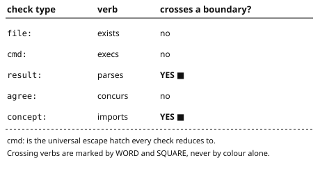
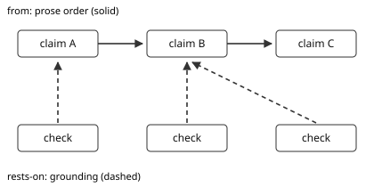
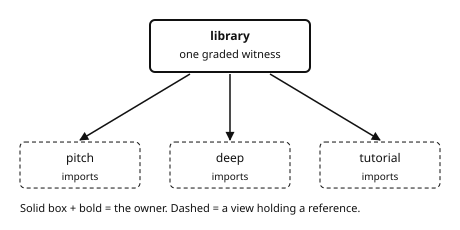
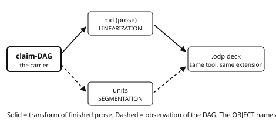

# CI/CD Applied to Writing, Reasoning and Publishing

*Mike Mol — parts 1 and 2*

## Part 1 — Why: prose is the one artifact with no CI

Ship a wrong line of code and the build goes red in ninety seconds; ship a wrong line of prose and it is served to every new hire, integrator and auditor until someone burns an afternoon on it [@t-asymmetry]. The failure is not carelessness but TIME — the sentence was true when written, the system moved, the sentence stayed [@t-time], and the bill comes due in four places: onboarding wrong at step six, an integrator building on a stale spec, a compliance answer someone will hold you to, and a design record describing a system gone two years [@t-bill] (grounded above in [@t-asymmetry]). A real fix must be MECHANICAL (a machine decides), BLOCKING (a wrong sentence cannot ship), ABOUT ASSERTIONS (not that the samples parse), and SELF-AUDITING (it can tell you when the check itself is worthless) [@t-bars] (grounded above in [@t-time]); doc review, link lint, doctests and generated docs each clear one or two of those bars and none attempts the fourth [@t-nobody].

## Part 1 — How: claims, verbs, and the gate

So write CLAIMS, not prose — one bibliography entry per claim carrying a sentence, its section, what it depends on, and a machine verifier; the document is the DAG's projection, generated and never hand-authored [@t-claim]. Two commands do the work — project turns the claims into the document, gate verifies it — and three invariants hold: the committed prose equals its projection, every cited claim's check passes, and every section is covered both ways [@t-commands]. A verifier is named type:target and five verbs ship built in — file EXISTS, cmd EXECS, result PARSES a sibling project's verdict, agree CONCURS across independent producers, and concept IMPORTS a certificate — while cmd is the universal escape hatch every check reduces to, so a new domain adds named types in its own config without touching the engine [@t-verbs]. Two edges, not one: `from` sets prose order and connective glue, `rests-on` sets GROUNDING — and conflating them lets a well-structured argument hide a weak foundation, since a claim is never stronger than its weakest premise [@t-graphs] (grounded above in [@t-claim]);  — that is, the five built-in verbs with their resolution words, and the two that CROSS a project boundary marked by the word YES and a filled square rather than by colour — so a reader who cannot perceive the marking still has the distinction [@t-verbs-fig] (grounded above in [@t-verbs]).

Two edge types over the same claims — a solid chain giving prose order, and a dashed grounding DAG running the other way, so a claim's reading position and its logical support are drawn apart [@t-graphs-fig] (grounded above in [@t-graphs]).

A passing check proves only that a sentence NAMED a verifier, so the checks themselves are graded by mutation — drop a function body, corrupt an input, and see whether the check flips red; a check that cannot fail grades vacuous and that is a build error, not a review nitpick [@t-delta] (grounded above in [@t-bars]).

## Part 1 — How: concept libraries and composition

A CONCEPT LIBRARY authors and grades a proof ONCE, and every view imports its certificate — the verdict plus the engine fingerprint it was measured against — instead of re-authoring a parallel and usually weaker witness [@t-library], and the library is a HASH-CONS table rather than a cache of repeats — every concept interns to exactly one canonical node, so the test for lifting something in is whether it IS a concept, never whether it has been written twice [@t-hashcons], which lets one truth carry SEVERAL prose faces — a pitch, a deep exposition and a tutorial each speak in their own register while importing the identical proof, so the faces cannot drift and a view may add no witness code at all [@t-views];  — that is, one graded witness in a library, drawn as a solid bold box, with three views below it in dashed boxes each importing the certificate — the owner and the reference are told apart by border weight and dash pattern, never by hue [@t-library-fig].

Libraries are SHAREABLE across projects because the seam resolves consumer-first with per-key fallthrough — your own library answers the keys it owns, and a key it disclaims falls through to the engine's, so a downstream repository keeps its own concepts without losing access to the shared ones [@t-shareable] (grounded above in [@t-library]). Projects CITE EACH OTHER through exactly two boundary-crossing imports — a verdict import takes a sibling's whole gate result, a certificate import takes one graded concept — and both DELEGATE adequacy to the owner rather than re-deriving it [@t-compose] (grounded above in [@t-verbs]), and they CHAIN: a project may rest on a sibling that rests on a third, so a verdict carries the whole cone beneath it and a family of projects is one claim-DAG at a coarser grain — break the innermost and the outermost goes red [@t-chain].

## Part 2 — Accessibility

Accessibility becomes a set of GATED CLAIMS rather than an audit — each Supports in a conformance statement names a check, so a false one is a red build instead of a paragraph nobody re-reads [@t-a11y-claim], and the deliverable holds it BY CONSTRUCTION: the PDF is exported in PDF/UA mode with the title carried from the config through the producer, link and equation descriptions restored, and a validator run over the result at zero failed checks [@t-a11y-construct]. Which capability each FORMAT affords is owned as data — native, only-after-post-processing, or TOOLCHAIN-EXCEPTED, a named exception and never a silent gap — so a capability's reach is stated in one place and every demonstrated cell names the warrant that shows it [@t-a11y-matrix] (grounded above in [@t-a11y-claim]). A slide deck gets the same treatment: each slide carries a real title placeholder and its content as list structure, and every content image is held to a description in ITS OWN FRAME — per frame, because two images sharing one description would satisfy a count [@t-a11y-slides].

## Part 2 — Output formats

The render pipeline is a COALGEBRA tracked as data — format objects and conversion morphisms as an explicit adjacency matrix with one owner — so every declared edge's tool must be present, every route must compose real edges, and a new format is added in ONE place [@t-fmt-graph]: one verified source reaches Word, OpenDocument, LaTeX, PDF and a slide deck, each a first-class node rather than a script someone runs by hand [@t-fmt-many]. And presentation AGREEMENT extends the invariant down the stack — the plain text a reader sees in the rendered document is the plain text of the verified source, so the render cannot quietly misrepresent what was checked [@t-fmt-agree] (grounded above in [@t-fmt-graph]). A deck is the interesting case, because it is NOT a linearization — a document is one flat stream, a deck is a SEGMENTATION into bounded windows, so it is a different observation of the same claim-DAG rather than another export of finished prose [@t-fmt-deck] (grounded above in [@t-fmt-many]);  — that is, one carrier reaching the same deck two ways — a solid path through linearized prose, a dashed path through the segmentation — so the two deliverables that share a tool and an extension are told apart by the OBJECT they came from [@t-routes-fig].

What coheres and where a slide BREAKS are two independent axes — the grouping comes from the grounding graph, the pagination from a named objective (a talk cut, a teaching cut, a self-contained-document cut) registered like a check type, so a consumer adds its own without touching the engine [@t-fmt-genre] (grounded above in [@t-fmt-deck]).

## Part 2 — Testing

Every tool ships its behavioral boundaries as a triple — a minimal input that PASSES, a minimal input that FLAGS, and the minimum delta between them — because a tool documented only by its happy path has an undefined edge [@t-test-boundaries]; here is a passing example is DOCUMENTATION, here is the exact input that flips it is a SPECIFICATION [@t-test-spec]. And the same discipline turns on the checks themselves — mutation testing pointed at documentation, so a claim backed by a verifier that cannot fail is caught by the machine rather than by a careful reader [@t-test-mutation] (grounded above in [@t-delta]). Every derived artifact is regenerated and compared, never trusted — the prose, the figures, the knob tables, and the deck's own segmentation, so re-sectioning a single claim fails the build [@t-test-drift] (grounded above in [@t-commands]). And the honest limits are themselves gated claims: a check can be falsifiable yet sensitive to the wrong inputs, the gate proves a sentence NAMED a passing check rather than that the check ENTAILS it, and gating executes code — so the warrant set is trusted code, like a makefile [@t-test-limits] (grounded above in [@t-delta]).
